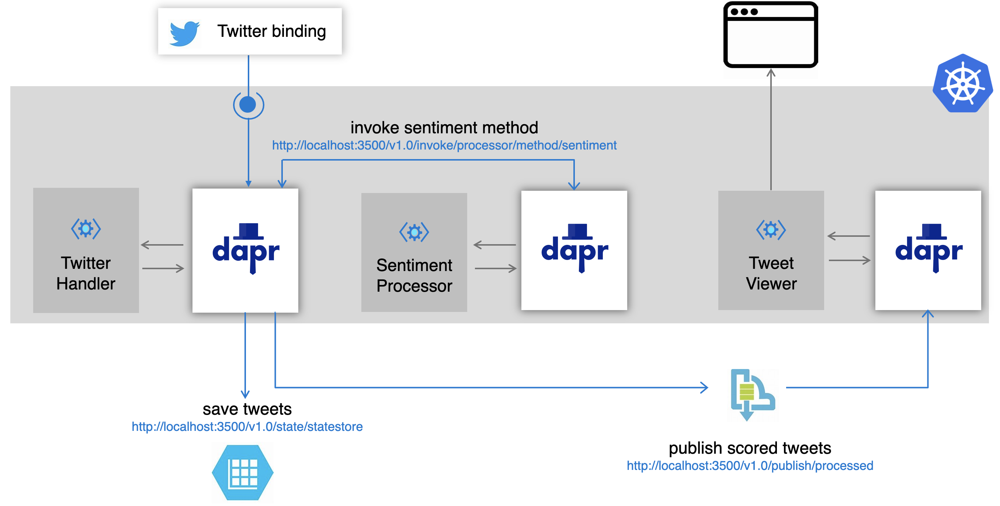
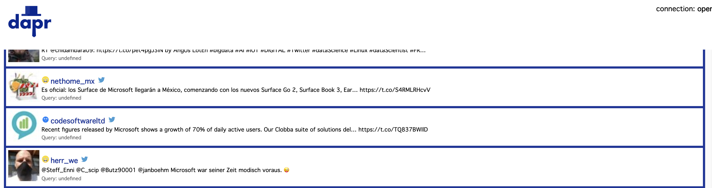
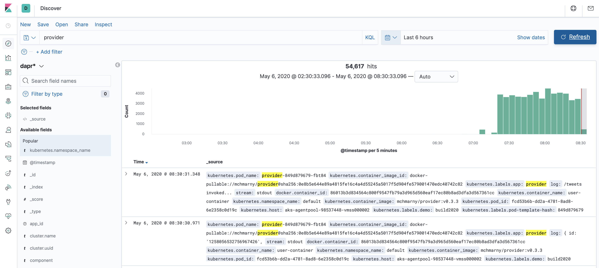

# Microsoft Build 2020 - Dapr

>Note: this demo uses Dapr v0.7.1 and may break if different Dapr versions are used

View the [recorded session](https://mybuild.microsoft.com/sessions/3f296b9a-7fe8-479b-b098-a1bfc7783476?source=sessions) and the [demo recordings](https://www.youtube.com/playlist?list=PLcip_LgkYwzu2ABITS_3cSV_6AeLsX-d0)

This demo illustrates the simplicity of [Dapr](https://github.com/dapr/dapr) on Day 1 and it's flexibility of Dapr to adopt to complex of complex use-cases Day 2 by walking through 3 demos:

* **Demo 1** - local development showing the speed with which developers can start and the use of Dapr components (Twitter and state)
* **Demo 2** - expands on Demo 1 and adds service invocation using both, direct invocation and consumption of events across applications using PubSub
* **Demo 3** - takes Demo 2 and illustrates how platform agnostic Dapr really is by containerizing these applications without any changes and deploying them onto Kubernetes. This demo also showcases the pluggability of components (state backed by Azure Table Storage, pubsub by Azure Service Bus)



## Demo 1

C# ASP.NET app (`provider`) using dapr Twitter input component to subscribe to Twitter search results. This app uses the default `statestore` to persist each tweet into the Redis backed `dapr` state store.

### Objectives

* Show idiomatic experience in Dapr allowing developers to be effective Day 1 (no Dapr libraries or attributes in user code)
* Introduce the concept of components as a way to leverage existing capabilities

### Requirements

* Docker
* Node.js or dotnet core > 3.1 (instructions below are for Node.js though demo can be run using dotnet)
* [Twitter API credentials](https://developer.twitter.com/en/docs/basics/getting-started)

Twitter credentials will have to be added to `components/twitter.yaml`:

  ```yaml
      spec:
        type: bindings.twitter
        # PLACE TWITTER CREDS HERE
        metadata:
        - name: consumerKey
          value: "" # twitter api consumer key, required
        - name: consumerSecret
          value: "" # twitter api consumer secret, required
        - name: accessToken
          value: "" # twitter api access token, required
        - name: accessSecret
          value: "" # twitter api access secret, required
        - name: query
          value: "dapr" # your search query, required 
  ```

### Run demo 1 

Starting from the root of demo 1 (`demos/demo1`)

* Install [Dapr CLI](https://github.com/dapr/docs/blob/master/getting-started/environment-setup.md#installing-dapr-cli)
* Run

  ```sh
  dapr init
  ```
* Launch app locally using Dapr by running (example, running via dotnet)

  ```sh
  dapr run --app-id provider --app-port 5000 --port 3500 node app.js
  ```

* Post a tweet with the word `dapr` (e.g. "watching a cool dapr demo #build2020")
* Show dapr log to see the debug info
* View Redis for persisted data 

## Demo 2

Demo 2 builds on demo 1. It illustrates interaction between multiple microservices in Dapr (`processor` being invoked by `processor`) and adds the concept of pubsub, where each scored tweet in stead of being saved in state store is being published onto a topic. This demo also includes a Go viewer app (`viewer`) which subscribes to pubsub `processed-tweets` topic and streaming scored tweets over WebSockets to a SPA in JavaScript which displays streamed tweets.

### Objectives

* Builds on Demo 1, illustrate interaction between multiple microservices in Dapr 
* Introduces service to service discovery/invocation 
* Introduces eventing using Dapr pubsub component 

### Requirements
* Go
* [Azure Account](https://azure.microsoft.com/en-us/free/)
* [Cognitive Services account](https://docs.microsoft.com/en-us/azure/cognitive-services/cognitive-services-apis-create-account)

### Run demo 2

Starting from the root of demo 2 (`demos/demo2`)

[Start processor](https://github.com/azure-octo/build2020-dapr-demo/tree/master/demos/demo2/processor) so it's ready when `provider` starts 

> Make sure you have the defined the `CS_TOKEN` environment variable holding your Azure Cognitive Services token [docs](https://docs.microsoft.com/en-us/azure/cognitive-services/authentication)

```shell
cd processor
dapr run node app.js --app-id processor --app-port 3002 --protocol http --port 3500
```

[Start viewer](https://github.com/azure-octo/build2020-dapr-demo/tree/master/demos/demo1/viewer) so it's ready when `provider` starts 

```shell
cd viewer
dapr run go run handler.go main.go --app-id viewer --app-port 8083 --protocol http
```

Navigate to the viewer UI in browser (make sure WebSockets connection is opened)

http://localhost:8083


[Start provider](https://github.com/azure-octo/build2020-dapr-demo/tree/master/demos/demo2/provider) provider 

> For demo purposes use a frequently tweeted about topic, like microsoft. You need to change that search term in the [demos/demo2/provider/components/twitter.yaml](demos/demo2/provider/components/twitter.yaml) file under `query` metadata element BEFORE you start provider

```shell
cd provider
dapr run node app.js --app-id provider --app-port 3001 --protocol http
```

Switch back to the UI to see the scored tweets 

http://localhost:8083

The UI should look something like this 



## Demo 3

Demo 3 takes the local development work and illustrates how platform agnostic the developer experience really is in Dapr by deploying all the previously developed code onto Kubernetes.

> Note, this demo requires Dapr v0.7

### Objectives

* Show deployment of locally developed artifacts onto Kubernetes 
* Illustrate the run-time portability and component pluggability 

### Run demo 3

> Assumes the use of pre-built images for [provider](https://hub.docker.com/repository/docker/mchmarny/provider), [processor](https://hub.docker.com/repository/docker/mchmarny/processor), and [viewer](https://hub.docker.com/repository/docker/mchmarny/viewer)


This instructions assume [Azure CLI](https://docs.microsoft.com/en-us/cli/azure/install-azure-cli?view=azure-cli-latest) has been configured and that the following CLI defaults have been set:

```shell
az account set --subscription <id or name>
az configure --defaults location=<preferred location> group=<preferred resource group>
```

> Note, this demo installs into the `default` namespace in your cluster. When installing into a different namespace, make sure to append the `-n <your namespace name>` to all commands below (secret, component, and deployment) 

#### State Store  

To configure state component to use Azure Table Storage follow [these instructions](https://docs.microsoft.com/en-us/azure/storage/common/storage-account-create?tabs=azure-portal). Once finished, you will need to configure the Kubernates secrets to hold the Azure Table Storage token:

```shell
kubectl create secret generic demo-state-secret \
  --from-literal=account-name="" \
  --from-literal=account-key=""
```

Once the secret is configured, deploy the `dapr` state component from the `demos/demo3` directory:

```shell
kubectl apply -f component/statestore.yaml
```

#### PubSub Topic 

To configure pubsub component to use Azure Service Bus follow [these instructions](https://docs.microsoft.com/en-us/azure/service-bus-messaging/service-bus-quickstart-topics-subscriptions-portal). Once finished, you will need to configure the Kubernates secret to hold Azure Service Bus connection string information. 


```shell
kubectl create secret generic demo-bus-secret \
  --from-literal=connection-string=""
```

Once the secret is configured, deploy the `dapr` pubsub topic components from the `demos/demo3` directory:

```shell
kubectl apply -f component/pubsub.yaml
```

#### Twitter Input Binding  

Finally, to use the Dapr Twitter input binding we need to configure the Twitter API secretes. You can get these by registering Twitter application and obtain this information [here](https://developer.twitter.com/en/apps/create).

```shell
kubectl create secret generic demo-twitter-secrets \
  --from-literal=access-secret="" \
  --from-literal=access-token="" \
  --from-literal=consumer-key="" \
  --from-literal=consumer-secret=""
```

Once the secret is configured you can deploy the Twitter binding:

```shell
kubectl apply -f component/twitter.yaml
```


#### Deploy Demo 

Once the necessary components are created, you just need to create one more secret for the Cognitive Service token that is used in the `processor` service: 

```shell
kubectl create secret generic demo-processor-secret \
  --from-literal=token=""
```

And now you can deploy the entire pipeline (`provider`, `processor`, `viewer`) with a single command:

```shell
kubectl apply -f provider.yaml \
              -f processor.yaml \
              -f viewer.yaml
```

You can check on the status of your deployment like this: 

```shell
kubectl get pods -l demo=build2020
```

The results should look similar to this (make sure each pod has READY status 2/2)

```shell
NAME                        READY   STATUS    RESTARTS   AGE
processor-89666d54b-hkd5t   2/2     Running   0          18s
provider-85cfbf5456-lc85g   2/2     Running   0          18s
viewer-76448d65fb-bm2dc     2/2     Running   0          18s
```

#### Exposing viewer UI

To expose the viewer application externally, create Kubernetes `service` using [route.yaml](./viewer-route.yaml)

```shell
kubectl apply -f service/viewer.yaml
```

> Note, the provisioning of External IP may take little time. 

To view the viewer application:

```shell
export VIEWER_IP=$(kubectl get svc viewer --output 'jsonpath={.status.loadBalancer.ingress[0].ip}')
open "http://${VIEWER_IP}/"
```

> To change the Twitter topic query simply edit the [demos/demo3/component/twitter.yaml](demos/demo3/component/twitter.yaml), apply it, and `kubectl rollout restart deployment provider` to ensure the new configuration is applied. 

#### Observability 

You can view the scored tweets in Azure table storage 


Similarly you can monitor the pubsub topic throughout in Azure Service Bus 


In addition to the state and pubsub, you can also observe Dapr metrics and logs for this demo. 

The Dapr sidecar Grafana dashboard 


And the Elastic backed Kibana dashboard for logs



For tracing first apply the tracing config 

```shell
kubectl apply -f tracing/tracing.yaml
```

And then, if you have not already have it, install Zipkin 


```shell
kubectl create deployment zipkin --image openzipkin/zipkin
kubectl expose deployment zipkin --type ClusterIP --port 9411
```

And configure the Zipkin exporter

```shell
kubectl apply -f tracing/zipkin .yaml
```

You may have to restart the deployments 

```shell
kubectl rollout restart deployment processor provider viewer
```


At this point you should be able to access the Zipkin UI 

http://localhost:9411/zipkin/


