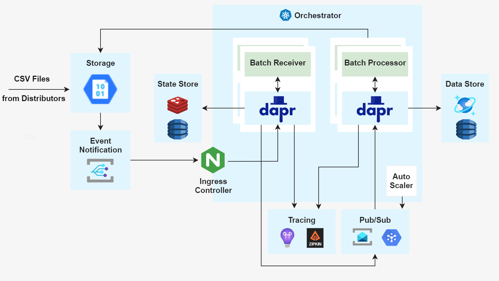
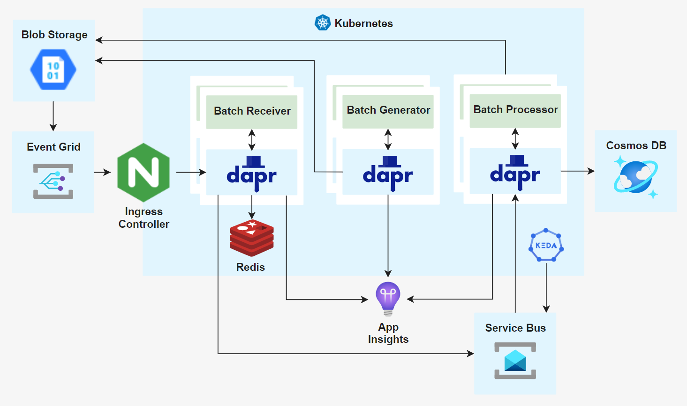
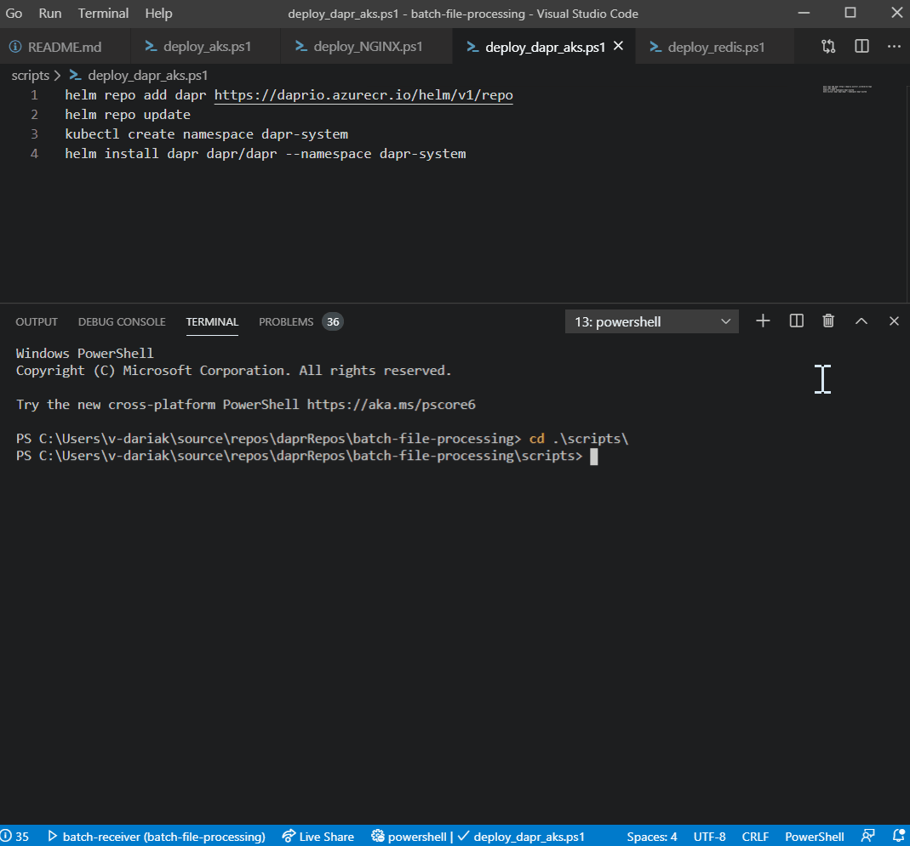

# Dapr - Batch File Processing End-to-End Sample

| Attribute            | Details    |
| -------------------- | ---------- |
| Dapr runtime version | v0.10      |
| Language             | JavaScript |
| Environment          | Kubernetes |

This sample demonstrates an end-to-end sample for processing a batch of related text files using microservices and Dapr. Through this sample you will learn about Dapr's state management, bindings, Pub/Sub, and end-to-end tracing. The sample was last validated on Dapr v0.10.

## Scenario

An enterprise receives sales orders from distributors via CSV files, similar to that of many businesses. These files come in batches. Each batch is made up of exactly three different files, each with different information about orders. Here is an example of a batch:

`20180518151300-OrderHeaderDetails.csv`

`20180518151300-OrderLineItems.csv`

`20180518151300-ProductInformation.csv`

Files from the same batch have the same prefix, a date time format. These files can arrive in any order and at different times, so we need wait until all the files for the same batch arrive before processing them. The processing of a batch consists of combining the content of all three these files, converting them from CSV to one JSON per order, and storing each order into a data store.

## Solution

This sample implementation for the batch file processing scenario combines Dapr and Azure. As Dapr is cloud independent it would be possible to reimplement the solution using non-Azure or different Azure components. In this sample Azure services like Service Bus and Cosmos DB, App Insight as a backend for tracing are used, but other services could be used; for example, instead of using Service Bus as a message broker, Redis Streams or Google Cloud Pub/Sub could be used. The same would apply for state store, output binding to database, and tracing.

Azure Storage receives batches of files (from the [Batch Generator](batchGenerator) simulator). Each file will trigger an Event Grid notification to a [Batch Receiver](batchReceiver) microservice that uses state management to identify when all files for a batch have arrived. Then Pub/Sub is used to trigger a [Batch Processor](batchProcessor) that will transform the batches into individual JSON based orders, and save to Cosmos DB. Dapr's end-to-end tracing is used to send tracing information to App Insights. Pub/Sub is used to provide a layer of load levelling and for scaling the Batch Processor using KEDA, as the processor does the bulk of the processing work.

In this reference implementation the following components are used.

### Components

`Storage` - Azure Blob Storage is where the batches of files will arrive. This sample includes a [Batch Generator](batchGenerator) to simulate distributors sending batches of files into storage.

`Event Grid` - Event Grid is used to send event notifications of new blobs (each file in the batches) to the ingress controller of Kubernetes (NGINX in this sample).

`Kubernetes/Azure Kubernetes Service (AKS)` - used to orchestrate and host the containers and their Dapr sidecars for the microservices implemented by this sample, as well as NGINX and the Redis instance used by the solution.

`NGINX` - the ingress controller for Kubernetes used in this sample that will receive the notifications from Event Grid about new blobs in storage and route them to the Batch Receiver microservice.

`Batch Generator` - a node app microservice that simulates distributors generating CSV files with order information and sends them to `Storage` every 1 min.

`Batch Receiver` - a node app microservice running in Kubernetes that gets called for each CSV file. It has a Dapr sidecar to provide tracing, state management, and Pub/Sub features. It extracts the file prefix as a batch id, then uses that batch id as the key for writing to Dapr's state management, keeping track of what files arrived for each batch. It uses Dapr's state management with `Redis` to get and [update the state](batchReceiver/routes/blobAddedHandler.js#L48). Once a batch has all 3 files, Batch Receiver will [put a message into Dapr Pub/Sub](batchReceiver/routes/blobAddedHandler.js#L75) (batchReceived topic) using `Service Bus` as a message broker.

`Batch Processor` - a node app microservice triggered from Dapr's Pub/Sub. It has a Dapr sidecar to provide tracing, Pub/Sub, and output binding features. It [subscribes to messages](batchProcessor/routes/subscribe.js#L9) from the batchReceived topic and when a message is received, it will fetch all the three files for a batch from storage, transform them into an array of JSON orders and [store each JSON order into `Cosmos DB`](batchProcessor/routes/subscribe.js#L41). It uses Dapr's Cosmos DB output binding to store the data. This microservice is scaled using `KEDA`.

`KEDA` - [Kubernetes-based Event Driven Autoscaling](https://github.com/kedacore/keda). Used to scale out the Batch Processor based on the number of unprocessed messages in the Service Bus topic used between the microservices for Pub/Sub.

`Cosmos DB` - the NoSQL data store used by the sample to store the individual orders in JSON format. This would then be used downstream by other solutions in the company.

`App Insights` - Azure App Insights is used for all the end-to-end tracing created by Dapr for the microservices in the solution.

### Deployment

Follow [these steps](deployment.md) to deploy the solution.

### Running and observing the sample

After you deploy the solution you can follow [these steps](observing-sample.md) to run and observe the sample.

