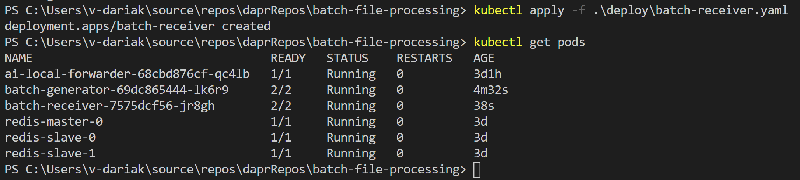
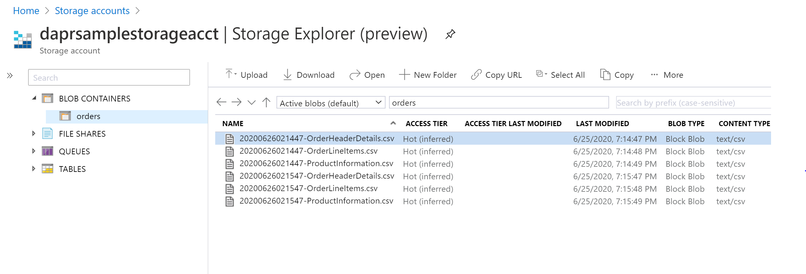
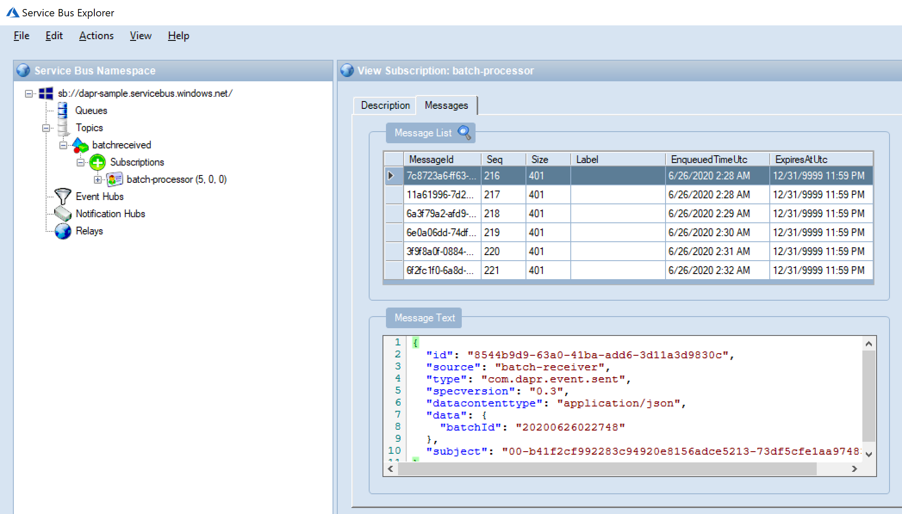
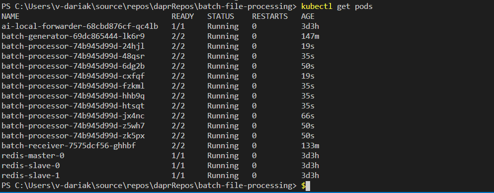
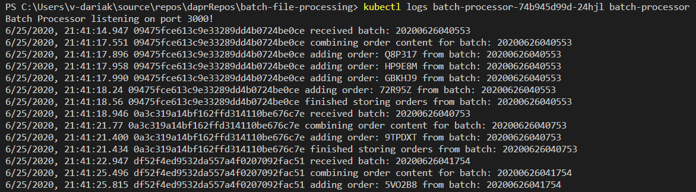
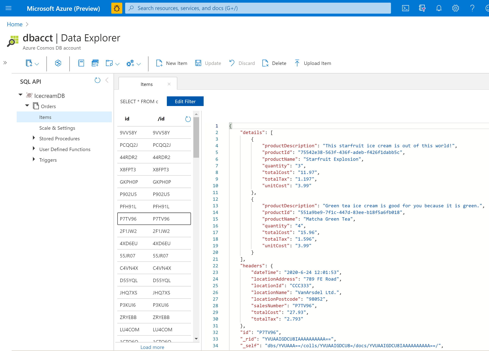
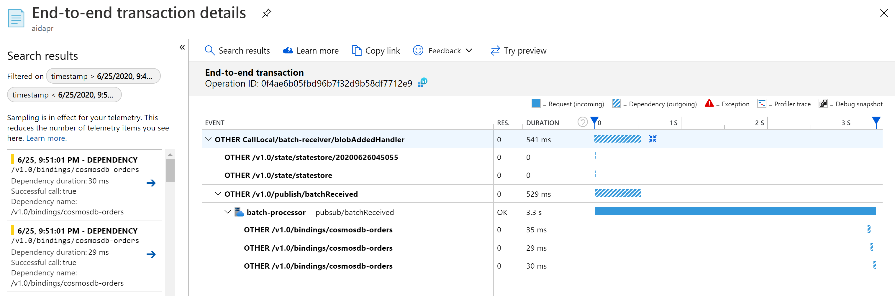

# Running and observing the sample

## Prerequisites

* Deploy the solution following [these steps](deployment.md).
* Download and launch the [Service Bus Explorer](https://github.com/paolosalvatori/ServiceBusExplorer/releases).
* Optionally, download and install the [Microsoft Azure Storage Explorer](https://azure.microsoft.com/en-us/features/storage-explorer/#overview).

## Demo

1. Stop Batch Processor so that only Batch Receiver and Batch Generator are running in your cluster.

    

2. Navigate to the storage account in the Azure portal or the Azure Storage Explorer. You should see the batches of CSV files arrive into the blob storage every minute.

    

3. Each file added will trigger an Event Grid notification to the Batch Receiver microservice which will be storing the files into a state store using batch ID (file prefix) as a key to identify when all files for a batch have arrived.

4. Once a batch has all 3 files, Batch Receiver will put a message into Dapr Pub/Sub (batchReceived topic) using `Service Bus` as a message broker.

5. Connect to your namespace in the Service Bus Explorer.

6. Go to your topic (batchreceived), then subscription (batch-processor). Right click on the subscription and refresh. In the parentheses (next to the subscription name) you can see the number of messages in the Service Bus queue. Click on the Message button to view the messages.

    

7. Wait until there are more messages in the queue.

8. In our [deployment file](deploy/batch-processor-keda.yaml) we defined that we would like to scale our Batch Processor if there are 5 or more messages in the Service Bus queue (queueLength: '5'). You can also define a maximum number of concurrent replicas via maxReplicaCount.

9. Now let's run our Batch Processor to process the messages.

    ```powershell
    kubectl apply -f .\deploy\batch-processor-keda.yaml
    ```

10. Check the pods. You should see multiple instances of batch-processor running, the number will depend on the `queueLength` and `maxReplicaCount` values. In my example I had over 100 messages in the queue and set queueLength to 5 and maxReplicaCount to 10.

    

11. 2/2 in the READY column in the output means there are 2 containers running in each pod: one is your application and another one is the dapr sidecar.

12. Check the logs of a batch-processor instance. When a message is received (that the batch is ready), Batch Processor will fetch all the three files for a batch from storage, transform them into an array of JSON orders and store each JSON order into `Cosmos DB`.

    

13. Go to Cosmos DB account in the Azure portal or the Azure Storage Explorer and check that the orders were saved successfully.

    

14. Refresh the subscription in the Service Bus Explorer, the number of message should go down to 0.

15. Navigate to the Application Insights resource in the Azure portal.

16. In the left menu, click Search and select a custom period of time.

17. Select any request from the search results.

18. The following end-to-end transaction view should show up.
    

Here we can see how a request propagates through our distributed microservices.

Dapr intercepts all incoming requests and if a request does not have a correlation ID in the header, dapr will create one and pass it in `traceparent` header. In order to stitch a transaction end-to-end you need to read the correlation id from the request and pass it to all requests made through dapr.