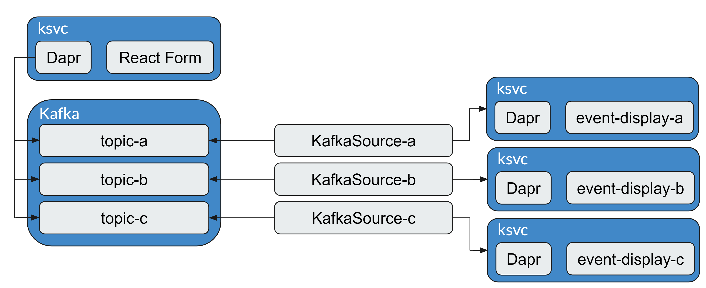
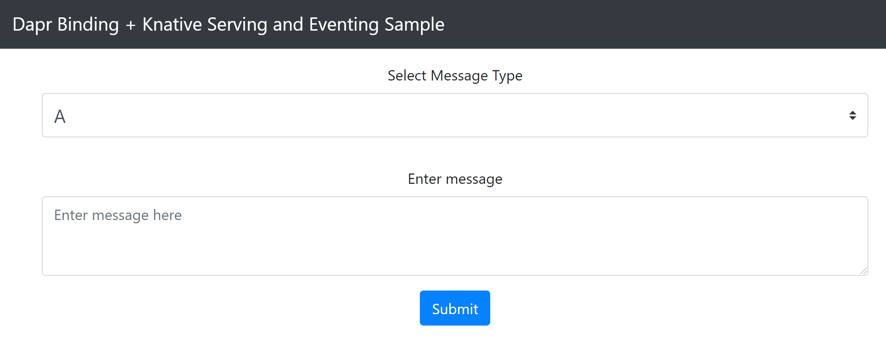

# Darp Binding + Knative Serving and Eventing

| Attribute               | Details                    |
| ----------------------- | -------------------------- |
| Dapr runtime version    | v1.5.0                     |
| Knative Serving version | v1.0                       |
| Language                | Javascript, Python, Go, C# |
| Environment             | Kubernetes > v1.20         |

This is a sample application based on Dapr bindings quickstart using:

- Knative Serving (with Kourier) to host React Form and backend applications
- Dapr Bindings to put events into the Kafka topics
- Knative Eventing to read events from Kafka topics and distribute them to backend applications

This is built as a proof-of-concept to show how to use Knative and Dapr.



## Prerequisites

This sample requires you to have the following installed on your machine:

- [Dapr CLI](https://github.com/dapr/cli/tree/release-1.5) v1.5.0
- [kubectl](https://kubernetes.io/docs/tasks/tools/install-kubectl/)
- An online hoster Kubernetes cluster, such as [AKS](https://docs.dapr.io/operations/hosting/kubernetes/cluster/setup-aks/) or [GKE](https://cloud.google.com/kubernetes-engine/)
- React Form that will be used to send events to Dapr. The image is hosted under my Docker Hub account, but you can change it to your own. Source files can be found [here](https://github.com/dapr/samples/tree/bindings-knative-eventing/bindings-knative-eventing/react-form) and [here](https://github.com/TenSt/dapr-sample-react-form).

Also, unless you have already done so, clone the repository with the samples and `cd` into the right directory:

```bash
git clone https://github.com/dapr/samples.git
cd samples/bindings-knative-eventing
```

## Step 1 - Make sure that your kubectl client is working

The first thing you need is an enabled Kubernetes cluster. This sample was tested on a fully-fledged cluster.

Once you have that make sure you get a positive response from the following kubectl command

```bash
kubectl get pods
```

This should either have output as `No resources found in default namespace.` or should list the pods running the `default` namesapce.

## Step 2 - Setup Dapr

Follow [instructions](https://docs.dapr.io/getting-started/install-dapr/) to download and install the Dapr CLI and initialize Dapr.

## Step 3 - Setup Knative Serving and Eventing

> **Note**: Here you can find full [instruction](https://knative.dev/docs/install/serving/install-serving-with-yaml/) of how to install and configure Knative Serving. All the information below in steps 3 and 4 is an excerpt from it which was used and tested.

### Install Knative Serving CRDs

```bash
kubectl apply -f https://github.com/knative/serving/releases/download/knative-v1.0.0/serving-crds.yaml
```

### Install Knative Serving Core

```bash
kubectl apply -f https://github.com/knative/serving/releases/download/knative-v1.0.0/serving-core.yaml
```

### Install Knative Kourier - networking layer

```bash
kubectl apply -f https://github.com/knative/net-kourier/releases/download/knative-v1.0.0/kourier.yaml
```

### Configure Knative to use Kourier

```bash
kubectl patch configmap/config-network \
  --namespace knative-serving \
  --type merge \
  --patch '{"data":{"ingress.class":"kourier.ingress.networking.knative.dev"}}'
```

### Verify installation

```bash
kubectl get pods -n knative-serving
```

All pods inside `knative-serving` namespace should have `Running` or `Completed` status.

## Step 3 - Configure DNS for Knative

### Fetch the External IP address by running the command

```bash
kubectl --namespace kourier-system get service kourier
```

### Configure DNS

This sample was tested with real DNS. In this case, you need to take the External IP address from the previous step and add it to your DNS wildcard `A` record (e.g. `*.knative.example.com`).

### Direct Knative to use that domain

Please change `knative.example.com` below to your domain.

```bash
kubectl patch configmap/config-domain \
  --namespace knative-serving \
  --type merge \
  --patch '{"data":{"knative.example.com":""}}'
```

### Install Knative Eventing CRDs

```bash
kubectl apply -f kubectl apply -f https://github.com/knative/eventing/releases/download/knative-v1.0.0/eventing-crds.yaml
```

### Install Knative Eventing Core

```bash
kubectl apply -f https://github.com/knative/eventing/releases/download/knative-v1.0.0/eventing-core.yaml
```

### Install Knative Extention - Kafka Source

```bash
kubectl apply -f https://github.com/knative-sandbox/eventing-kafka/releases/download/knative-v1.0.0/source.yaml
```

## Step 4 - Install Kafka cluster

As a part of this sample, I'm using Strimzi to create and install Kafka clusters. Here is the [instruction](https://strimzi.io/quickstarts/) of how to do that.

Here is a quick excerpt from it:

### Create a namespace for Kafka

```bash
kubectl create namespace kafka
```

### Apply all installation files (this will also create Strimzi operator)

```bash
kubectl create -f 'https://strimzi.io/install/latest?namespace=kafka' -n kafka
```

### Wait until Strimzi operator is up and running

```bash
kubectl get pod -n kafka
```

### Create new Kafka cluster

```bash
kubectl apply -f https://strimzi.io/examples/latest/kafka/kafka-persistent-single.yaml -n kafka
```

### Wait until Kafka cluster is up and running

```bash
kubectl wait kafka/my-cluster --for=condition=Ready --timeout=300s -n kafka
```

## Step 5 - Setup Sample

### Apply Knative part

```bash
kubectl apply -f knative/.
```

### Apply Dapr part

```bash
kubectl apply -f dapr/.
```

### Verification

Verify that there are 3 pods from KafkaSource in `default` namespace:

```bash
kubectl get pods
```

Example output:

```bash
NAME                                                              READY   STATUS    RESTARTS   AGE
kafkasource-a-26f8b1a8-519a-4717-bdf2-e49bacb5dc9d-898bdff676s2   1/1     Running   0          3d3h
kafkasource-b-297a7da3-9503-4685-9f02-4745f412af5f-7cbbdfc998n7   1/1     Running   0          3d3h
kafkasource-c-c31fa8d2-51a5-482e-91cd-071ef4b52221-5cbd795mckpz   1/1     Running   0          3d3h
```

Verify that there are 4 Knative Services created. Make sure that `READY` is set to `True`. Otherwise, please wait until all the necessary components are configured by Knative.

```bash
kubectl get ksvc
```

Example output:

```bash
NAME              URL                                                LATESTCREATED          LATESTREADY            READY   REASON
event-display-a   http://event-display-a.default.svc.cluster.local   event-display-a-rev1   event-display-a-rev1   True
event-display-b   http://event-display-b.default.svc.cluster.local   event-display-b-rev1   event-display-b-rev1   True
event-display-c   http://event-display-c.default.svc.cluster.local   event-display-c-rev1   event-display-c-rev1   True
react-form        http://react-form.default.knative.example.com      react-form-rev1        react-form-rev1        True
```

## Step 6 - How it works

### Deploy files

In the `deploy` folder we have two folders: `knative` and `dapr` which holds respective items.

Knative folder contain 3 types of resources: Knative service, Kafka Source, and Kafka Topic.
Dapr folder contain 2 types of resources: Knative service and Dapr Binding component.

#### Knative Service

By default, Knative Serving will scale to zero its workloads if there is no traffic to them. Wait for a couple of minutes and run the next command to list all pods in the `default` namespace:

```bash
kubectl get pods
```

Example output:

```bash
NAME                                                              READY   STATUS    RESTARTS   AGE
kafkasource-a-26f8b1a8-519a-4717-bdf2-e49bacb5dc9d-898bdff676s2   1/1     Running   0          3d3h
kafkasource-b-297a7da3-9503-4685-9f02-4745f412af5f-7cbbdfc998n7   1/1     Running   0          3d3h
kafkasource-c-c31fa8d2-51a5-482e-91cd-071ef4b52221-5cbd795mckpz   1/1     Running   0          3d3h
```

As you can see, there are only pods from `KafkaSource` and there are no pods of React Form and Event Display applications. [Here](https://knative.dev/docs/serving/services/) you can find all details about Knative Services.

#### Kafka Source

The `KafkaSource` reads all the messages, from all partitions, and sends those messages as CloudEvents through HTTP to its configured sink. If the sink is not available, no pods will be created. Here is the detailed [instruction](https://knative.dev/docs/eventing/sources/kafka-source/).

Let's have a look at the yaml file of `kafkasource-a`:

```yaml
apiVersion: sources.knative.dev/v1beta1
kind: KafkaSource
metadata:
  name: a
spec:
  consumerGroup: knative-group
  bootstrapServers:
    - my-cluster-kafka-bootstrap.kafka:9092 # note the kafka namespace
  topics:
    - topic-a
  sink:
    ref:
      apiVersion: serving.knative.dev/v1
      kind: Service
      name: event-display-a
```

Necessary items ouf of it:
`bootstrapServers` - this is the address of your Kafka server
`topics` - list of topics from which we will read events
`sink` - the reference to the service which should receive events

List all Kafka Sources:

```bash
kubectl get kafkasource
```

Example output:

```bash
NAME   TOPICS        BOOTSTRAPSERVERS                            READY   REASON   AGE
a      ["topic-a"]   ["my-cluster-kafka-bootstrap.kafka:9092"]   True             3d5h
b      ["topic-b"]   ["my-cluster-kafka-bootstrap.kafka:9092"]   True             3d3h
c      ["topic-c"]   ["my-cluster-kafka-bootstrap.kafka:9092"]   True             3d3h
```

#### Kafka Topic

This is an optional resource that is used if you use Strimzi. It is used by the Topic operator to keep topics in sync with the Kafka cluster. Here is [detailed instruction](https://strimzi.io/docs/operators/latest/using.html#overview-concepts-topic-operator-str).

List all Kafka Topics:

```bash
kubectl get kafkatopics -n kafka
```

Example output:

```bash
NAME                                                                                               CLUSTER      PARTITIONS   REPLICATION FACTOR   READY
consumer-offsets---84e7a678d08f4bd226872e5cdd4eb527fadc1c6a                                        my-cluster   50           1                    True
strimzi-store-topic---effb8e3e057afce1ecf67c3f5d8e4e3ff177fc55                                     my-cluster   1            1                    True
strimzi-topic-operator-kstreams-topic-store-changelog---b75e702040b99be8a9263134de3507fc0cc4017b   my-cluster   1            1                    True
topic-a                                                                                            my-cluster   3            1                    True
topic-b                                                                                            my-cluster   3            1                    True
topic-c                                                                                            my-cluster   3            1                    True
```

#### Dapr Binding component

This component allows you to bind your apps with external systems using events. In this particular case, we use Output bindings to send events to our Kafka topics. [Here](https://docs.dapr.io/reference/components-reference/supported-bindings/kafka/) you can find details about Kafka binding component.

List all Dapr components:

```bash
kubectl get components
```

Example output:

```bash
NAME      AGE
topic-a   3d4h
topic-b   3d3h
topic-c   3d3h
```

We use a separate component for each external topic to which we will send events.

### Sample in action

Navigate to the address of your React Form Knative service (<http://react-form.default.knative.example.com>) with your browser and you should see the React Form.



Using drop-down menu send some messages to the A, B and C. Then go back to your console and list all pods:

```bash
kubectl get pods
```

You should see that now we have pods running for our React Form and 3 backend Event Display applications:

```bash
NAME                                                              READY   STATUS    RESTARTS   AGE
event-display-a-rev1-deployment-84b98798d8-dgdt5                  3/3     Running   0          14s
event-display-b-rev1-deployment-7445b94cbb-mwfdg                  3/3     Running   0          11s
event-display-c-rev1-deployment-786c7bcbbb-gc9jn                  2/3     Running   0          6s
kafkasource-a-26f8b1a8-519a-4717-bdf2-e49bacb5dc9d-898bdff676s2   1/1     Running   0          3d4h
kafkasource-b-297a7da3-9503-4685-9f02-4745f412af5f-7cbbdfc998n7   1/1     Running   0          3d4h
kafkasource-c-c31fa8d2-51a5-482e-91cd-071ef4b52221-5cbd795mckpz   1/1     Running   0          3d4h
react-form-rev1-deployment-849ddfb5cd-86jxs                       3/3     Running   0          29s
```

Take a look at logs of each backend Event Display application and you should see an event with a message that you've sent:

```bash
☁️  cloudevents.Event
Context Attributes,
  specversion: 1.0
  type: dev.knative.kafka.event
  source: /apis/v1/namespaces/default/kafkasources/a#topic-a
  subject: partition:1#1
  id: partition:1/offset:1
  time: 2021-12-16T22:16:31.497Z
Data,
  {"message":"test A"}
```

Wait a minute and you will see that Knative Serving will scale our apps back to zero:

```bash
kubectl get pods
```

Example output:

```bash
NAME                                                              READY   STATUS    RESTARTS   AGE
kafkasource-a-26f8b1a8-519a-4717-bdf2-e49bacb5dc9d-898bdff676s2   1/1     Running   0          3d3h
kafkasource-b-297a7da3-9503-4685-9f02-4745f412af5f-7cbbdfc998n7   1/1     Running   0          3d3h
kafkasource-c-c31fa8d2-51a5-482e-91cd-071ef4b52221-5cbd795mckpz   1/1     Running   0          3d3h
```

### Conclustion

Knative is a powerful platform that provides different tools to deploy and manage modern serverless workloads. Combining it with Dapr opens up a lot of different scenarios which can help developers to implement their solutions.
