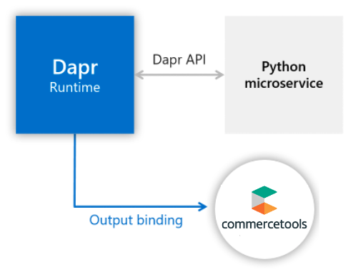

# Dapr Bindings - commercetools

In this quickstart sample, you'll create a microservice with an output binding. You'll bind to commercetools, but note that there are a myriad of components that Dapr can bind to ([see Dapr components](https://docs.dapr.io/concepts/components-concept/)). 

This quickstart includes one microservice:

- Python microservice that utilizes an output binding

The binding connects to commercetools, allowing you to query or manipulate a commercetools projects using a provided GraphlQL query without having to know where the instance is hosted. Instead, connect through the sidecar using the Dapr API. See architecture diagram to see how the components interconnect locally:



Dapr allows us to deploy the same microservices from the local machines to Kubernetes. Correspondingly, this quickstart has instructions for deploying this project [locally](#Run-Locally) or in [Kubernetes](#Run-in-Kubernetes).

## Prerequisites

### Prerequisites to Run Locally

- [Dapr CLI with Dapr initialized](https://docs.dapr.io/getting-started/install-dapr/)
- [Python 3.4 or greater](https://www.python.org/)

### Prerequisites to Run in Kubernetes

- [Dapr enabled Kubernetes cluster](https://docs.dapr.io/operations/hosting/kubernetes/kubernetes-deploy/)

## Run Locally

### Clone the quickstarts repository
Clone this quickstarts repository to your local machine:

```bash
git clone https://github.com/harrykimpel/dapr-commercetools-sample.git
```

### Run Python Microservice with Output Binding

Next, run the Python microservice that uses output bindings

1. Open a new CLI window and navigate to Python subscriber directory in your CLI: 

```bash
cd pythonapp
```

2. Install dependencies:

<!-- STEP
name: Install python dependencies
working_dir: ./pythonapp
-->

```bash
pip3 install requests
```

<!-- END_STEP -->

3. Run Python quickstart app with Dapr: 

<!-- STEP
name: Run node app
working_dir: ./pythonapp
background: true
sleep: 25
output_match_mode: substring
expected_stdout_lines: 
  - "You're up and running! Both Dapr and your app logs will appear here."
  - "== APP == products found: 25"
  - "== APP == - product name: miabag-handbag-14538-black"
  - "== APP == - product name: miabag-handbag-15104-beige"
  - "== APP == - product name: miabag-handtaschen-15117-pink"
  - "..."
  - "Exited Dapr successfully"
  - "Exited App successfully"
-->

```bash
dapr run --app-id bindings-pythonapp python3 app.py --components-path ../components
```

<!-- END_STEP -->

### Observe Logs

1. Observe the Python logs, which show a successful output binding with Kafka:

```bash
[0m?[94;1m== APP == products found: 25
[0m?[94;1m== APP == - product name: miabag-handbag-14538-black
[0m?[94;1m== APP == - product name: miabag-handbag-15104-beige
[0m?[94;1m== APP == - product name: miabag-handtaschen-15117-pink
...
```

### Cleanup

To cleanly stop the dapr microservices, run:

<!-- STEP
output_match_mode: substring
expected_stdout_lines: 
  - 'app stopped successfully: bindings-nodeapp'
  - 'app stopped successfully: bindings-pythonapp'
expected_stderr_lines:
name: Shutdown Dapr and Kafka
-->

```bash
dapr stop --app-id bindings-pythonapp
```

<!-- END_STEP -->

## Run in Kubernetes

### Deploy Assets

1. In your CLI window, in the bindings directory run: 

<!-- STEP
name: Run kubernetes apps
sleep: 30
expected_stdout_lines: 
  - component.dapr.io/sample-commercetools created
  - deployment.apps/bindings-pythonapp created
  - 'deployment "bindings-pythonapp" successfully rolled out'
-->

```bash
kubectl apply -f ./deploy
```

This will deploy bindings-pythonapp microservices. It will also apply the commercetools bindings component configuration you set up in the last step.

Kubernetes deployments are asyncronous. This means you'll need to wait for the deployment to complete before moving on to the next steps. You can do so with the following command:

```bash
kubectl rollout status deploy/bindings-pythonapp
```

<!-- END_STEP -->

2. Run `kubectl get pods` to see that pods were correctly provisioned.

### Observe Logs

Observe the Python app logs, which show a successful output binding with Kafka:

```bash
kubectl get pods
```

The output should look like this:

```bash
NAME                                    READY   STATUS        RESTARTS   AGE
bindings-pythonapp-644489969b-c8lg5     2/2     Running       0          4m9s
```

Look at the Python app logs by running:

<!-- STEP
name: Read Python Logs
expected_stdout_lines:
  - "commercetoolsAPI: GraphQLQuery"
  - "HandleGraphQLQuery"
-->

```bash
kubectl logs --selector app=bindingspythonapp -c python --tail=-1
```

<!-- END_STEP -->

```bash
...
commercetoolsAPI: GraphQLQuery
HandleGraphQLQuery
...
```

### Cleanup

Once you're done, you can spin down your Kubernetes resources by running:

<!-- STEP
name: Cleanup
expected_stdout_lines:
-->

```bash
kubectl delete -f ./deploy
```

This will spin down each resource defined by the .yaml files in the `deploy` directory, including the commercetools component.

<!-- END_STEP -->

## How it Works

Now that you've run the quickstart locally and/or in Kubernetes, let's unpack how this all works. The app is composed of an output binding app:

### commercetools Bindings yaml

Before looking at the application code, let's see the commercetools bindings component yamls([local](./components/commercetools_bindings.yaml), and [Kubernetes](./deploy/commercetools_bindings.yaml)), which specify `API client settings` for commercetools connection.

> See the howtos in [references](#references) for the details on input and output bindings

This configuration yaml creates `sample-project` component to set up commercetools an output binding through the commercetools `project-key` project. 

```yaml
apiVersion: dapr.io/v1alpha1
kind: Component
metadata:
  name: sample-project
  namespace: commerce
spec:
  type: bindings.commercetools
  version: v1
  metadata:
  - name: Region
    value: europe-west1
  - name: Provider
    value: gcp
  - name: ProjectKey
    value: project-key
  - name: ClientID
    value: client-id
  - name: ClientSecret
    value: client-secret
  - name: Scopes
    value: manage_project:project-key
```

### Python Output binding app

Navigate to the `pythonapp` directory and open `app.py`, the code for the output bindings sample app. This sends POST request to Dapr http endpoint `http://localhost:3500/v1.0/bindings/<output_bindings_name>` with the event payload every second. This app uses `sample-project` bindings component name as `<output_bindings_name>`. Then Dapr runtime will send the event to `project-key` project which is specified in the above commercetools bindings component yaml.

```python
dapr_url = "http://localhost:{}/v1.0/bindings/sample-project".format(dapr_port)
n = 0
while True:
    n += 1
    queryProductProjectionSearch = ''\
        'query { '\
            'productProjectionSearch(text: "bag", locale: "en", limit: 25) {'\
                'total '\
                'count '\
                'results { '\
                    'id '\
                    'name (locale: "en") '\
                    'slug (locale: "en") '\
                '}'\
            '}'\
        '}'
    query = queryProductProjectionSearch
    graphQLPayload = { "data": { "commercetoolsAPI": "GraphQLQuery", "query": query }, "operation": "create" }
    print(payload, flush=True)
    try:
        response = requests.post(dapr_url, json=graphQLPayload)
        dict = response.json()
        print('products found: '+str(dict['productProjectionSearch']['count']), flush=True)
            for key in dict['productProjectionSearch']['results']:
                print ("- product name: "+key["slug"], flush=True)

    except Exception as e:
        print(e)

    time.sleep(1)
```

## Related links

- Learn more about bindings in the [Dapr docs](https://docs.dapr.io/developing-applications/building-blocks/bindings/)
- How to [create an event-driven app using input bindings](https://docs.dapr.io/developing-applications/building-blocks/bindings/howto-triggers/)
- How to [send events to external systems using Output Bindings](https://docs.dapr.io/developing-applications/building-blocks/bindings/howto-bindings/)

## Next Steps

- Explore additional [quickstarts](https://github.com/dapr/quickstarts).
