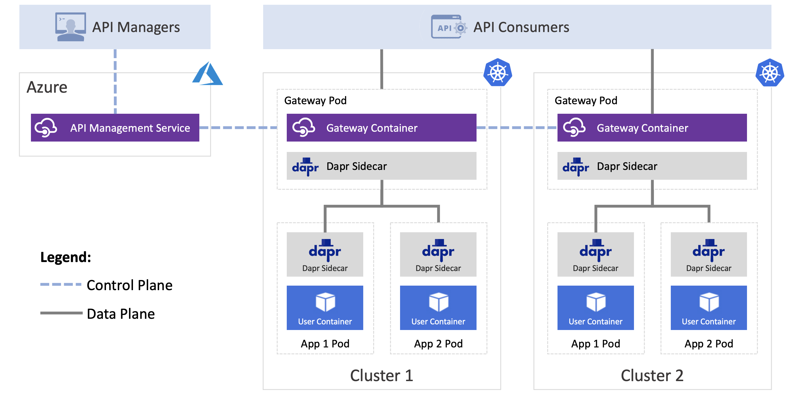
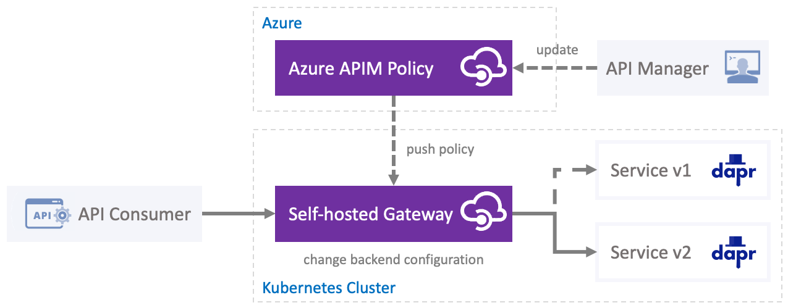
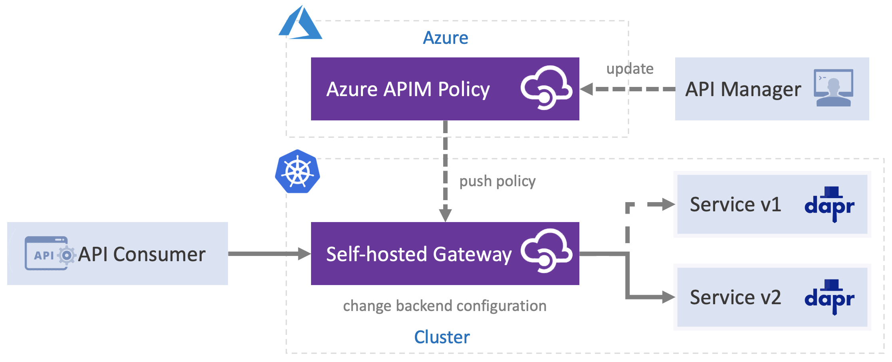

# Dapr & Azure API Management Integration Demo

Dapr integration with [Azure API Management](https://azure.microsoft.com/en-us/services/api-management/) (APIM) using self-hosted gateway on Kubernetes. 



In this demo we will walk through the configuration of API Management service and its self-hosted gateway on Kubernetes. To illustrate the Dapr integration we will also review three Dapr use-cases:

* Invocation of a specific Dapr service method
* Publishing content to a Pub/Sub topic 
* Binding invocation with request content transformation

In addition, we will overview the use of APIM tracing to debug your configuration. 

> While you can accomplish everything we show here in Azure portal, to make this demo easier to reliably reproduce, we will be using only the Azure CLI and APIs.

## Prerequisite 

* [Azure account](https://azure.microsoft.com/en-us/free/)
* [Azure CLI](https://docs.microsoft.com/en-us/cli/azure/install-azure-cli?view=azure-cli-latest)
* [Kubernetes cluster with Dapr](https://github.com/dapr/docs/blob/v0.9.0/getting-started/environment-setup.md#installing-dapr-on-a-kubernetes-cluster)
* [Helm](https://helm.sh/docs/intro/install/)

| Attribute | Details |
|--------|--------|
| Dapr runtime version | v0.10.0 |
| Language | APIs only for configuration, optionally, go for source of used images | 
| Environment | Kubernetes |

## Terminology

You will see a few different APIs being used throughout this demo. At one point we are even going to use one API to manage another (API inception?). Here is short summary to help you keep all these APIs straight. Hope it helps: 

* [Azure API](https://docs.microsoft.com/en-us/rest/api/apimanagement/) - this is the API provided by Azure to manage its service (yes, including the API Management Service)
* [API in APIM](https://docs.microsoft.com/en-us/azure/api-management/edit-api) - is the API which we will define in APIM service. Its operations will be used by the users
* [Dapr API](https://github.com/dapr/docs/tree/master/reference/api#dapr-api-reference) - are the RESTful HTTP APIs defined by Dapr which developers interact with building applications

## Setup 

To make this demo easier to reproduce, start by exporting the name for your new Azure API Management (APIM) service.

> Note, the name of your API Management service instance has to be globally unique!

```shell
export APIM_SERVICE_NAME="dapr-apim-demo"
```

In addition also export the Azure [Subscription ID](https://docs.bitnami.com/azure/faq/administration/find-subscription-id/) and [Resource Group](https://docs.bitnami.com/azure/faq/administration/find-deployment-resourcegroup-id/) where you want to create that service.

```shell
export AZ_SUBSCRIPTION_ID="your-subscription-id"
export AZ_RESOURCE_GROUP="your-resource-group"
```

## Azure API Management 

We will start by configuring the Azure API Management service.

### Service Creation

Create service instance:

> The `publisher-email` and `publisher-name` are only required to receive system notifications e-mails.

```shell
az apim create --name $APIM_SERVICE_NAME \
               --subscription $AZ_SUBSCRIPTION_ID \
               --resource-group $AZ_RESOURCE_GROUP \
               --publisher-email "you@your-domain.com" \
               --publisher-name "Your Name"
```

> Note, depending on the SKU and resource group configuration, this operation may take 15+ min. While this running, consider quick read on [API Management Concepts](https://docs.microsoft.com/en-us/azure/api-management/api-management-key-concepts#-apis-and-operations)

### API Configuration

Each [API operation](https://docs.microsoft.com/en-us/azure/api-management/api-management-key-concepts#-apis-and-operations) defined in APIM will map to one Dapr API. To define these mappings you will use OpenAPI format defined in [apim/api.yaml](./apim/api.yaml) file. You will need to update the OpenAPI file with the name of the APIM service created above:

```yaml
servers:
  - url: http://<YOUR-APIM-SERVICE-NAME>.azure-api.net
  - url: https://<YOUR-APIM-SERVICE-NAME>.azure-api.net
```

When finished, import that OpenAPI definition fle into APIM service instance:

```shell
az apim api import --path / \
                   --api-id dapr \
                   --subscription $AZ_SUBSCRIPTION_ID \
                   --resource-group $AZ_RESOURCE_GROUP \
                   --service-name $APIM_SERVICE_NAME \
                   --display-name "Demo Dapr Service API" \
                   --protocols http https \
                   --subscription-required true \
                   --specification-path apim/api.yaml \
                   --specification-format OpenApi
```

> Notice the `subscription-required` parameter is set to `true` which means that all invocations against the `dapr` API will need a subscription key. We cover how to obtain the subscription key later. 

### Azure API Token

Export the Azure management API token to use through this demo.

```shell
export AZ_API_TOKEN=$(az account get-access-token --resource=https://management.azure.com --query accessToken --output tsv)
```

> If you receive an error later that your token expired, just re-run this command

### Policy Management

APIM [Policies](https://docs.microsoft.com/en-us/azure/api-management/api-management-key-concepts#--policies) are sequentially executed on each request. We will start by defining "global" policy to throttle all operation invocations on our API, then add individual policies for each operation to add specific options.

#### Global Policy

APIM policies are defined inside of inbound, outbound, and backend elements. In our case to apply policy that will rate-limit all requests on all operations (before they are forwarded to Dapr API), we will place the global policy within the `inbound` section. 

> Note, the rate limit quota we defined here is being shared across all the replicas of self-hosted gateway. In default configuration, where there are 2 replicas, this policy would actually be half of the permitted calls per minute.

```xml
<policies>
     <inbound>
          <rate-limit-by-key  
               calls="120"
               renewal-period="60"
               increment-condition="@(context.Response.StatusCode == 200)"
               counter-key="@(context.Request.IpAddress)" />
     </inbound>
     ...
</policies>
``` 

Apply that [policy](apim/policy-all.json) to all operations submit it to the Azure management API.

```shell
curl -i -X PUT \
     -d @apim/policy-all.json \
     -H "Content-Type: application/json" \
     -H "If-Match: *" \
     -H "Authorization: Bearer ${AZ_API_TOKEN}" \
     "https://management.azure.com/subscriptions/${AZ_SUBSCRIPTION_ID}/resourceGroups/${AZ_RESOURCE_GROUP}/providers/Microsoft.ApiManagement/service/${APIM_SERVICE_NAME}/apis/dapr/policies/policy?api-version=2019-12-01"
```

If everything goes well, the management API will return the created policy.

#### Echo Service Policy 

The Dapr service invocation handles all the service discovery, so to invoke a specific method on any Dapr service users follow this API: 

```http
POST/GET/PUT/DELETE /v1.0/invoke/<appId>/method/<method-name>
```

To enable users to invoke the `echo` method on Dapr service with ID of `echo-service` we will create a policy that inherits the global policy (`<base />`) first, to ensure only authorize service invocation are passed to the backend Dapr API. Then to "map" the invocation we set `dapr` as the "backend-id" and define the Dapr service and method attributes to specific service ID and method name.

```xml
<policies>
     <inbound>
          <base />
          <set-backend-service 
               backend-id="dapr" 
               dapr-app-id="echo-service" 
               dapr-method="echo" />
     </inbound>
     ...
</policies>
```

To apply [this policy](apim/policy-echo.json) to the `echo` operation on our API, submit it to the Azure management API:

```shell
curl -i -X PUT \
     -d @apim/policy-echo.json \
     -H "Content-Type: application/json" \
     -H "If-Match: *" \
     -H "Authorization: Bearer ${AZ_API_TOKEN}" \
     "https://management.azure.com/subscriptions/${AZ_SUBSCRIPTION_ID}/resourceGroups/${AZ_RESOURCE_GROUP}/providers/Microsoft.ApiManagement/service/${APIM_SERVICE_NAME}/apis/dapr/operations/echo/policies/policy?api-version=2019-12-01"
```

If everything goes well, the management API will return the created policy. Additional information about Dapr Service Invocation in APIM are available [here](https://aka.ms/apim/dapr/invoke). 

Also, since the external mapping of the API user invocations to Dapr is done in APIM policy, it can be easily re-mapped to any other version as the API implementation evolves over time. 



#### Message Topic Policy 

In addition to Dapr service invocation, APIM can also be used to publish to Dapr Pub/Sub API:

```http
POST /v1.0/publish/<pubsubname>/<topic>
```

To expose the `messages` topic configured in the `demo-events` component we will start by inheriting the global policy like before, and then set the publish policy to format the request that will be passed to the Dapr Pub/Sub API:

```xml
<policies>
     <inbound>
        <base />
        <publish-to-dapr 
               topic="@("demo-events/messages")" 
               response-variable-name="pubsub-response"
        >@(context.Request.Body.As<string>())</publish-to-dapr>
        <return-response 
               response-variable-name="pubsub-response" />
    </inbound>
     ...
</policies>
```

To apply [this policy](apim/policy-message.json) to the `message` operation on our API, submit it to the Azure management API:


```shell
curl -i -X PUT \
     -d @apim/policy-message.json \
     -H "Content-Type: application/json" \
     -H "If-Match: *" \
     -H "Authorization: Bearer ${AZ_API_TOKEN}" \
     "https://management.azure.com/subscriptions/${AZ_SUBSCRIPTION_ID}/resourceGroups/${AZ_RESOURCE_GROUP}/providers/Microsoft.ApiManagement/service/${APIM_SERVICE_NAME}/apis/dapr/operations/message/policies/policy?api-version=2019-12-01"
```

If everything goes well, the management API will return the created policy. Additional information about Dapr Pub/Sub support in APIM are available [here](https://aka.ms/apim/dapr/pubsub).

#### Save Binding Policy 

In our final case, we are going to overview exposing the Dapr binding API.

```http
POST/PUT /v1.0/bindings/<name>
```

In contrast to the previous policies, rather than just forwarding the original request content, we are going to create a brand new request based on the content of the original request and mapping it to the format expected by Dapr API. This capability comes handy when your API needs to stay the same while the backing service evolves API evolves over time. Consider the payload expected by Dapr binding API: 

```json
{
  "data": "",
  "metadata": {
    "": "",
    "": ""
  },
  "operation": ""
}
```

The policy will first define a `key` variable that will be generated using system guid. Once defined, that variable can be used later on in the policy. To accommodate the binding format expected by Dapr, the policy will then set `operation` attribute in APIM `invoke-dapr-binding` policy, and set `metadata` items to:

* `source` which will be a static value indicating the record came from `APIM`
* `client-ip` which will be set to the client request IP
* `key` which will be set to the value of the variable defined above

Finally, for `data`, we simply use the original content of the client request.

```xml
<policies>
    <inbound>
        <base />
        <set-variable name="key" 
                      value="@{ return Guid.NewGuid().ToString(); }" />
        <invoke-dapr-binding 
                      name="demo-binding" 
                      operation="create" 
                      response-variable-name="binding-response">
            <metadata>
                <item key="source">APIM</item>
                <item key="client-ip">@( context.Request.IpAddress )</item>
                <item key="key">@( (string)context.Variables["key"] )</item>
            </metadata>
            <data>@( context.Request.Body.As<string>() )</data>
        </invoke-dapr-binding>
        <return-response response-variable-name="binding-response" />
    </inbound>
     ...
</policies>
```

To apply [this policy](apim/policy-save.json) to the `save` operation on our API, submit it to the Azure management API:

```shell
curl -i -X PUT \
     -d @apim/policy-save.json \
     -H "Content-Type: application/json" \
     -H "If-Match: *" \
     -H "Authorization: Bearer ${AZ_API_TOKEN}" \
     "https://management.azure.com/subscriptions/${AZ_SUBSCRIPTION_ID}/resourceGroups/${AZ_RESOURCE_GROUP}/providers/Microsoft.ApiManagement/service/${APIM_SERVICE_NAME}/apis/dapr/operations/save/policies/policy?api-version=2019-12-01"
```

> Note, the support in APIM for bindings is still rolling out across Azure regions. You can safely skip this section and just demo service invocation and topic publishing if you receive an error that `invoke-dapr-binding` is not recognize.

If everything goes well, the management API will return the created policy. Additional information about Dapr Binding support in APIM are available [here](https://aka.ms/apim/dapr/bind). 
 
### Gateway Configuration

To create a self-hosted gateway which will be then deployed to the Kubernetes cluster, first, we need to create the `demo-apim-gateway` object in APIM:

```shell
curl -i -X PUT -d '{"properties": {"description": "Dapr Gateway","locationData": {"name": "Virtual"}}}' \
     -H "Content-Type: application/json" \
     -H "If-Match: *" \
     -H "Authorization: Bearer ${AZ_API_TOKEN}" \
     "https://management.azure.com/subscriptions/${AZ_SUBSCRIPTION_ID}/resourceGroups/${AZ_RESOURCE_GROUP}/providers/Microsoft.ApiManagement/service/${APIM_SERVICE_NAME}/gateways/demo-apim-gateway?api-version=2019-12-01"
```

And then map that gateway to the previously created API:

```shell
curl -i -X PUT -d '{ "properties": { "provisioningState": "created" } }' \
     -H "Content-Type: application/json" \
     -H "If-Match: *" \
     -H "Authorization: Bearer ${AZ_API_TOKEN}" \
     "https://management.azure.com/subscriptions/${AZ_SUBSCRIPTION_ID}/resourceGroups/${AZ_RESOURCE_GROUP}/providers/Microsoft.ApiManagement/service/${APIM_SERVICE_NAME}/gateways/demo-apim-gateway/apis/dapr?api-version=2019-12-01"
```

If everything goes well, the API returns JSON of the created objects.

## Kubernetes 

Switching now to the Kubernetes cluster...

### Dependencies 

To showcase the ability to expose Dapr pub/sub and binding APIs in APIM, we are going to need [Dapr components](https://github.com/dapr/docs/tree/master/concepts#components) configured on the cluster. 

> Note, while Dapr supports some 75+ different components, to keep things simple in this demo we will use Redis as both pub/sub and binding backing service

Start with adding the Redis repo to your Helm charts:

```shell
helm repo add bitnami https://charts.bitnami.com/bitnami
helm repo update
```

And install Redis and wait for the deployment to complete:

> Note, for simplicity, we are deploying everything into the `default` namespace.

```shell
helm install redis bitnami/redis  
kubectl rollout status statefulset.apps/redis-master
kubectl rollout status statefulset.apps/redis-slave
```

### Dapr Components 

Dapr's modular design means that we can easily extend its functionality using [components](https://github.com/dapr/docs/tree/master/concepts#components). The specific implementation for these components which can be any number of the readily available Dapr building blocks is done in configuration. That means that it's also easy to swap or reconfigure them at runtime without the need to modify your code. 



To create the binding component to point to the above created Redis cluster the configuration looks like this:

```yaml
apiVersion: dapr.io/v1alpha1
kind: Component
metadata:
  name: demo-events
spec:
  type: pubsub.redis
  metadata:
  - name: redisHost
    value: redis-master.default.svc.cluster.local:6379
  - name: redisPassword
    secretKeyRef:
      name: redis
      key: redis-password
  - name: allowedTopics
    value: "messages"
```

Notice we are using the secret created by Redis for password so that our configuration doesn't include any secure information. We also specify that only the `messages` topic should be supported in this case. 

To apply these component configurations run: 

```shell
kubectl apply -f k8s/pubsub.yaml
kubectl apply -f k8s/binding.yaml
```

### Dapr Services 

To deploy your application as a Dapr service all you need to do is augment your Kubernetes deployment template with few Dapr annotations.

```yaml
annotations:
     dapr.io/enabled: "true"
     dapr.io/id: "event-subscriber"
     dapr.io/port: "8080"
```

> To learn more about Kubernetes sidecar configuration see [Dapr docs](https://github.com/dapr/docs/blob/master/concepts/configuration/README.md#kubernetes-sidecar-configuration).

For this demo we will use pre-build Docker images of two applications: [gRPC Echo Service](src/grpc-echo-service) and [HTTP Event Subscriber](src/http-event-subscriber). The Kubernetes deployment files for both of these are located here:

* [k8s/echo-service.yaml](k8s/echo-service.yaml)
* [k8s/event-subscriber.yaml](k8s/event-subscriber.yaml)

Deploy both of these and check that it is ready:

```shell
kubectl apply -f k8s/echo-service.yaml
kubectl apply -f k8s/event-subscriber.yaml
kubectl get pods -l demo=dapr-apim -w
```

> Service is ready when its status is `Running` and the ready column is `2/2` (Dapr and our echo service containers both started)

```shell
NAME                                READY   STATUS    RESTARTS   AGE
echo-service-668986b998-v2ssp       2/2     Running   0          10m
event-subscriber-7d68b67d9d-5v7bf   2/2     Running   0          10m
```

To make sure that the event subscriber connects to the Redis service you can query the service logs

```shell
kubectl logs -l app=event-subscriber -c daprd | grep demo-events
```

You should see entries containing: 

```shell
app responded with subscriptions [{demo-events messages /messages map[]}]
app is subscribed to the following topics: [messages] through pubsub=demo-events
subscribing to topic=messages on pubsub=demo-events
```

### Self-hosted APIM Gateway 

To connect the [self-hosted gateway](https://docs.microsoft.com/en-us/azure/api-management/how-to-deploy-self-hosted-gateway-kubernetes) to [APIM service on Kubernetes](https://docs.microsoft.com/en-us/azure/api-management/api-management-kubernetes), we will need to create a secret with the APIM gateway key. Start by getting the key which your gateway will use to connect to from APIM:

> Note, the maximum validity for access tokens is 30 days. Update the below `expiry` parameter to be withing 30 days from today

```shell
curl -i -X POST -d '{ "keyType": "primary", "expiry": "2020-10-10T00:00:01Z" }' \
     -H "Content-Type: application/json" \
     -H "Authorization: Bearer ${AZ_API_TOKEN}" \
     "https://management.azure.com/subscriptions/${AZ_SUBSCRIPTION_ID}/resourceGroups/${AZ_RESOURCE_GROUP}/providers/Microsoft.ApiManagement/service/${APIM_SERVICE_NAME}/gateways/demo-apim-gateway/generateToken?api-version=2019-12-01"
```

Copy the content of `value` from the response and create a secret:

```shell
kubectl create secret generic demo-apim-gateway-token --type Opaque --from-literal value="GatewayKey paste-the-key-here"
```

> Make sure the secret includes the `GatewayKey` and a space ` ` as well as the value of your token (e.g. `GatewayKey a1b2c3...`)

Now, create a config map containing the APIM service endpoint that will be used to configure your self-hosted gateway:

```shell
kubectl create configmap demo-apim-gateway-env --from-literal \
     "config.service.endpoint=https://${APIM_SERVICE_NAME}.management.azure-api.net/subscriptions/${AZ_SUBSCRIPTION_ID}/resourceGroups/${AZ_RESOURCE_GROUP}/providers/Microsoft.ApiManagement/service/${APIM_SERVICE_NAME}?api-version=2019-12-01"
```

And finally, deploy the gateway and check that it's ready:

```shell
kubectl apply -f k8s/gateway.yaml
kubectl get pods -l app=demo-apim-gateway
```

> Note, the self-hosted gateway is deployed with 2 replicas to ensure availability during upgrades. 

Make sure both instances have status `Running` and container is ready `2/2` (gateway container + Dapr side-car).

```shell
NAME                                 READY   STATUS    RESTARTS   AGE
demo-apim-gateway-6dfb968f5c-cb4t7   2/2     Running   0          26s
demo-apim-gateway-6dfb968f5c-gxrrq   2/2     Running   0          26s
```

To check on the gateway logs:

```shell
kubectl logs -l app=demo-apim-gateway -c demo-apim-gateway
```

## Usage (API Test)

With APIM configured and self-hosted gateway deployed we are ready to test. Start by capturing the cluster load balancer ingress IP:

```shell
export GATEWAY_IP=$(kubectl get svc demo-apim-gateway -o jsonpath='{.status.loadBalancer.ingress[0].ip}')
```

### API Subscription Key 

All of the APIs we defined in this demo are protected with subscription key. To invoke them, we will first need a subscription key: 

```shell
curl -i -H POST -d '{}' -H "Authorization: Bearer ${AZ_API_TOKEN}" \
     "https://management.azure.com/subscriptions/${AZ_SUBSCRIPTION_ID}/resourceGroups/${AZ_RESOURCE_GROUP}/providers/Microsoft.ApiManagement/service/${APIM_SERVICE_NAME}/subscriptions/master/listSecrets?api-version=2019-12-01"
```

The response will include both the primary and secondary keys. Copy one of them and export so we can use it for the rest of the demo:

```shell
export AZ_API_SUB_KEY="your-api-subscription-key"
```

### Service Invocation 

To invoke the backing gRPC service over Dapr API exposed by APIM run:

```shell
curl -i -X POST -d '{ "message": "hello" }' \
     -H "Content-Type: application/json" \
     -H "Ocp-Apim-Subscription-Key: ${AZ_API_SUB_KEY}" \
     -H "Ocp-Apim-Trace: true" \
     "http://${GATEWAY_IP}/echo"
```

If everything is configured correctly, you should see the response from your backing Dapr service: 

```json 
{ "message": "hello" }
```

In addition, you can also check the `echo-service` logs:

```shell
kubectl logs -l app=echo-service -c service
```

### Message Publishing 

To post a message to the Dapr Pub/Sub API exposed on APIM run:

```shell
curl -i -X POST \
     -d '{ "content": "hello" }' \
     -H "Content-Type: application/json" \
     -H "Ocp-Apim-Subscription-Key: ${AZ_API_SUB_KEY}" \
     -H "Ocp-Apim-Trace: true" \
     "http://${GATEWAY_IP}/message"
```

If everything is configured correctly, you will see `200` status code in the header, indicating the message was successfully delivered to the Dapr API.

You can also check the `event-subscriber` logs:

```shell
kubectl logs -l app=event-subscriber -c service
```

There should be an entry similar to this: 

```shell
event - PubsubName:demo-events, Topic:messages, ID:24f0e6f0-ab29-4cd6-8617-6c6c36ac1171, Data: map[message:hello]
```

### Binding Invocation

To save a record into database using the Dapr binding API exposed by APIM run:

```shell
curl -i -X POST \
     -d '{"city":"PDX","time":"1600171062","metric":"aqi","value": 457}' \
     -H "Content-Type: application/json" \
     -H "Ocp-Apim-Subscription-Key: ${AZ_API_SUB_KEY}" \
     -H "Ocp-Apim-Trace: true" \
     "http://${GATEWAY_IP}/save"
```

If everything is configured correctly, you will see `200` status code in the header indicating the binding was successfully triggered on the Dapr API and our record successfully saved into the DB. 

### Debugging 

Notice in each one of our API invocations we have been including the `Ocp-Apim-Trace: true` header parameter. APIM provides an ability to trace requests across the policy execution chain which is helpful in debugging your policy. The response of each one fo the above invocation includes the `Ocp-Apim-Trace-Location` header parameter. Just paste the value of that parameter into your browser to see the full trace stack in JSON. The trace can get pretty long so here are few Dapr-specific snippets: 


```json 
...
{
    "source": "request-forwarder",
    "timestamp": "2020-09-11T11:15:52.9405903Z",
    "elapsed": "00:00:00.1382166",
    "data": {
        "message": "Request is being forwarded to the backend service. Timeout set to 300 seconds",
        "request": {
            "method": "POST",
            "url": "http://localhost:3500/v1.0/publish/demo-events/messages"
        }
    }
},
{
    "source": "publish-to-dapr",
    "timestamp": "2020-09-11T11:15:53.1899121Z",
    "elapsed": "00:00:00.3875400",
    "data": {
        "response": {
            "status": {
                "code": 200,
                "reason": "OK"
            },
            "headers": [
                {
                    "name": "Server",
                    "value": "fasthttp"
                },
                {
                    "name": "Date",
                    "value": "Fri, 11 Sep 2020 11:15:52 GMT"
                },
                {
                    "name": "Content-Length",
                    "value": "0"
                },
                {
                    "name": "Traceparent",
                    "value": "00-5b1f0bdfc2191742a4635a906359a7aa-196f5df2e977b00a-01"
                }
            ]
        }
    }
}
...
```

## Updating Dapr Components 

If you updated components after deploying the gateway you will need to restart the deployments:

```shell
kubectl rollout restart deployment/event-subscriber
kubectl rollout status deployment/event-subscriber
kubectl rollout restart deployment/demo-apim-gateway
kubectl rollout status deployment/demo-apim-gateway
```

To check if the components were registered correctly in Dapr, inspect the `daprd` logs in `demo-apim-gateway` pod for `demo-events` and `demo-binding`:

```shell
kubectl logs -l app=demo-apim-gateway -c daprd --tail=200
```

## Summary 

This demo illustrated how to setup the APIM service and deploy the self-hosted gateway into your cluster. Using this gateway you can mange access to any number of Dapr services hosted on Kubernetes. You can find out more about all the features of APIM (e.g. Discovery, Caching, Logging etc.) [here](https://azure.microsoft.com/en-us/services/api-management/).

## Cleanup 

```shell
kubectl delete -f k8s/gateway.yaml
kubectl delete secret demo-apim-gateway-token
kubectl delete configmap demo-apim-gateway-env

kubectl delete -f k8s/echo-service.yaml
kubectl delete -f k8s/event-subscriber.yaml

kubectl delete -f k8s/pubsub.yaml
kubectl delete -f k8s/binding.yaml

az apim delete --name $APIM_SERVICE_NAME --no-wait --yes
```

