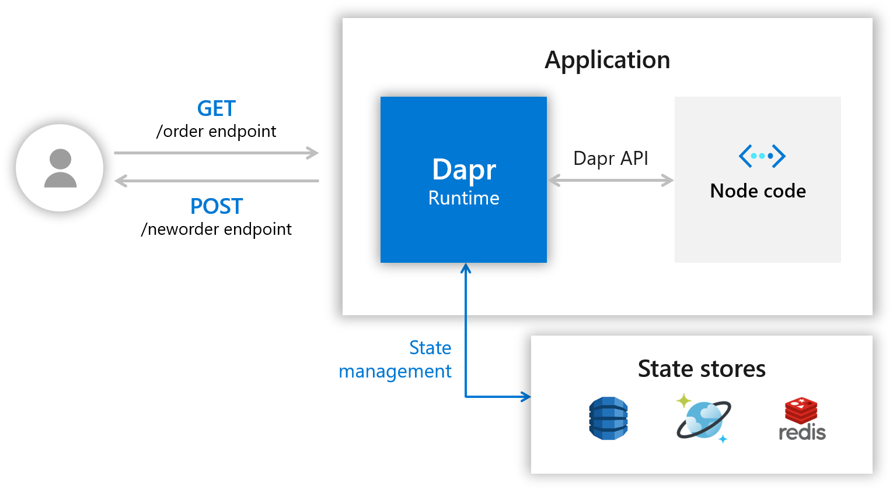

# Hello World with TypeScript

## Sample info

| Attribute | Details |
|--------|--------|
| Dapr runtime version | v0.11 |
| Language | TypeScript |
| Environment | Local |

## Overview

This tutorial and sample demonstrates how to use Dapr in a TypeScript application. You will deploy a TypeScript app that reads and write state via Dapr. The following architecture diagram illustrates the components that make up this sample: 



## Prerequisites
This sample requires you to have the following installed on your machine:
- [Docker](https://docs.docker.com/)
- [Node.js version 8 or greater](https://nodejs.org/en/) 
- Typescript: `npm install -g typescript`
- [Postman](https://www.getpostman.com/) [Optional]

## Step 1 - Setup Dapr

Follow [instructions](https://docs.dapr.io/getting-started/install-dapr/#install-dapr-in-self-hosted-mode) to download and install the Dapr CLI and initialize Dapr with `dapr init`.

## Step 2 - Understand the Code

Now that Dapr has been setup locally, clone the repo, then navigate to the `hello-typescript` sample: 

```bash
git clone https://github.com/dapr/samples.git
cd samples/hello-typescript
```

In the `app.ts` file you'll find a simple `express` application, which exposes two route handlers.

THe Dapr client is initialized as below:

```ts
var client = new dapr.dapr_grpc.DaprClient(
    `localhost:${daprGrpcPort}`, grpc.credentials.createInsecure());
```

Next, take a look at the ```neworder``` handler:

```ts
app.post('/neworder', (req, res) => {
    const data = req.body.data;
    const orderId = data.orderId;
    console.log("Got a new order! Order ID: " + orderId);

    var save = new dapr.dapr_pb.SaveStateRequest();
    save.setStoreName(stateStoreName)
    var state = new dapr.common_pb.StateItem();
    state.setKey("order");
    state.setValue(Buffer.from(JSON.stringify(data)));
    save.addStates(state);

    client.saveState(save, (error, _) => {
        if (error) {
            console.log(error);
            res.status(500).send({message: error});
        } else {
            console.log("Successfully persisted state.");
            res.status(200).send();
        }
    });
});
```

The endpoint `neworder` will receive and handle messages. The handler logs the incoming order id ans persists it using Dapr's state store.

Finally, check the ```order``` handler:

```ts
app.get('/order', (_req, res) => {
    var get = new dapr.dapr_pb.GetStateRequest();
    get.setStoreName(stateStoreName)
    get.setKey("order");
    client.getState(get, (error, response) => {
        if (error) {
            console.log(error);
            res.status(500).send({message: error});
        } else {
            console.log('Got!');
            console.log(String.fromCharCode.apply(null, response.getData()));
            res.status(200).send(String.fromCharCode.apply(null, response.getData()));
        }
    });
});
```

It will retrieve the state persisted with `order` key and return the content as the payload in the HTTP response.

## Step 3 - Run the Node.js App with Dapr

1. Install dependencies: 

    ```sh
    npm install
    ```

    This will install `typescript`, `express` and `body-parser`, among any other dependencies that are shown in `package.json`.

2. Run Node.js app with Dapr: 

    ```sh
    npm start
    ```

The command should output text that looks like the following, along with logs:

```
Starting Dapr with id nodeapp. HTTP Port: 3500. gRPC Port: 9165
You're up and running! Both Dapr and your app logs will appear here.
...
```
> **Note**: The `start` command is defined in the `package.json` file as `dapr run --app-id=nodeapp --dapr-http-port=3500 --app-port=3000 -- ts-node-dev --inspect --ignore-watch node_modules app.ts`.

## Step 4 - Post Messages to your Service

Now that Dapr and the Node.js app are running, you can POST messages against it, using different tools. **Note**: here you are POSTing against port 3000 - if you used a different port, be sure to update your URL accordingly.

First, POST the message by using Dapr cli in a new command line terminal:

Windows Command Prompt
```sh
dapr invoke --verb POST --app-id nodeapp --method neworder --data "{\"data\": { \"orderId\": \"41\" } }"
```

Windows PowerShell
```sh
dapr invoke --verb POST --app-id nodeapp --method neworder --data '{\"data\": { \"orderId\": \"41\" } }'
```

Linux or MacOS
```sh
dapr invoke --verb POST --app-id nodeapp --method neworder --data '{"data": { "orderId": "41" } }'
```

Next, GET the content of the persisted order:
```sh
dapr invoke --verb GET --app-id nodeapp --method order
```

And the response should be:
```sh
{"orderId":"41"}
```

Now, you can also do the same using `curl` with:

```sh
curl -XPOST -d @sample.json -H "Content-Type:application/json" http://localhost:3500/v1.0/invoke/nodeapp/method/neworder
```

```sh
curl -XGET http://localhost:3500/v1.0/invoke/nodeapp/method/order
```

Or, you can also do this using the Visual Studio Code [Rest Client Plugin](https://marketplace.visualstudio.com/items?itemName=humao.rest-client)

[sample_post.http](sample_post.http)
```http
POST http://localhost:3500/v1.0/invoke/nodeapp/method/neworder

{
  "data": {
    "orderId": "42"
  } 
}
```

[sample_get.http](sample_get.http)
```http
GET http://localhost:3500/v1.0/invoke/nodeapp/method/order
```

You can also use the Postman GUI.

Open Postman and create a POST request against `http://localhost:3500/v1.0/invoke/nodeapp/method/neworder`

In your terminal window, you should see logs indicating that the message was received and state was updated:
```
== APP == Got a new order! Order ID: 42
== APP == Successfully persisted state.
```

## Step 5 - Confirm Successful Service Invocation

Now, to make sure that the method definition was successfully invoked, verify that the the response is:

```
Got a new order! Order ID: 41
```

Additionally the log in the node application started with Dapr should be 

```
== APP == Got a new order! Order ID: 41
```

## Step 6 - Code Changes

In this sample, the project is setup in a way that code changes do not require the app to be restarted. Make a simple code change and see how it is loaded without the need to restart Dapr runtime or the app. The following log message can be modified and a new GET request made to reproduce this feature.

```ts
            console.log('Found order!');
```

## Step 7 - Cleanup

To stop your service from running, simply stop the "npm" process. Alternatively, you can spin down your service with the Dapr CLI "stop" command. For example, to spin down the service, run this command in a new command line terminal:

```bash
dapr stop --app-id nodeapp
```

To see that services have stopped running, run `dapr list`, noting that your services no longer appears!


## Next Steps

Now that you've gotten Dapr running locally on your machine with state store, consider these next steps:
- Learn more about Dapr in the [Dapr overview](https://docs.dapr.io/concepts/overview/) documentation.
- Explore other Dapr concepts such as building blocks and components in the [Dapr concepts](https://docs.dapr.io/concepts/) documentation.
- Look at other APIs available in the Dapr's [JavaScript SDK](https://github.com/dapr/js-sdk).
