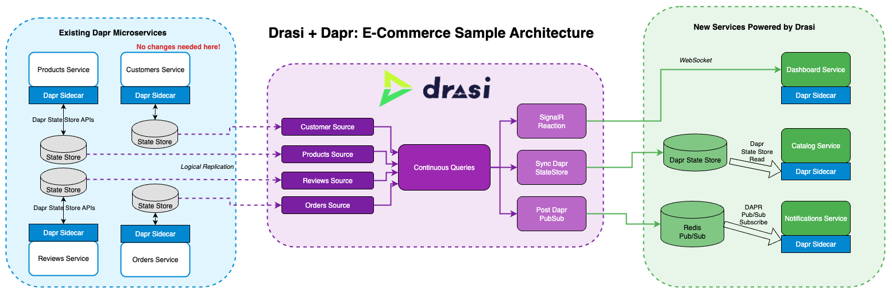

# Reactive Dapr apps with Drasi - An E-Commerce Example

| Attribute | Details |
|--------|--------|
| Dapr runtime version | v1.15.0 |
| Language | Python, TypeScript |
| Environment | Kubernetes (k3d) |

This sample demonstrates how [Drasi](https://drasi.io) can supercharge your Dapr applications by providing real-time reactive data processing capabilities across multiple microservices. Originally presented at the [Dapr Community Call #123](https://www.youtube.com/watch?v=S-ImhYfLplM&t=90s) ([presentation slides](https://docs.google.com/presentation/d/1w8Pcu4SKxbu5ygfBo1tLju3YzxznZlw7litKqAS23xI/edit#slide=id.g365a3536409_1_0)), this scenario showcases three powerful Drasi reactions that solve common challenges in distributed microservice architectures.

## What is Drasi?

Drasi is a Data Change Processing platform that makes it easier to build dynamic solutions that detect and react to complex data changes across multiple sources. Unlike traditional event processing, Drasi uses **declarative graph queries** to detect sophisticated patterns and conditions across your distributed data, and allows you to define custom actions in response to changes in your data.

Drasi is a CNCF project that provides:
- **Sources**: Connect to various data sources (PostgreSQL, MySQL, Cosmos Gremlin, Kubernetes, and more)
- **Continuous Queries**: Define complex conditions using graph queries that span multiple sources
- **Reactions**: Take actions when query results change (SignalR, Azure Event Grid, StorageQueue, and custom reactions)

### Key Innovation: Zero-Impact Change Detection

**Drasi monitors your data sources** - it doesn't poll your databases or call your service APIs. Your existing Dapr services continue using their state stores normally while Drasi:
- Subscribes to change logs or replication logs for near-real-time changes
- Maintains its own view of data without impacting service performance
- Processes complex queries across multiple databases in real-time
- Only sends notifications when meaningful business conditions are detected

### Why Drasi for Dapr Users?

- **Built with Dapr**: Drasi itself runs on Dapr-enabled Kubernetes and uses Dapr building blocks (Actors, Pub/Sub, State Stores, Service Invocation). Installing Drasi automatically installs Dapr
- **Non-Invasive**: Connects directly to your state stores via logical replication - no service changes needed
- **Solves Cross-Service Challenges**: Detect complex conditions spanning multiple services without custom correlation code
- **Real-Time Aggregations**: Maintain live, queryable views of data from multiple state stores
- **Intelligent Eventing**: Transform raw database changes into meaningful business events

## Scenario Overview

This sample implements an e-commerce platform with four core Dapr microservices, **each with its own state store**:

- **Products Service**: Manages product inventory and details
- **Customers Service**: Handles customer information and tiers (Gold, Silver, Bronze)
- **Orders Service**: Processes customer orders
- **Reviews Service**: Manages product reviews and ratings

### The Challenges We Solve

1. **Derived Data Challenge**: Creating a product catalog that combines product details with real-time review statistics

2. **Real-Time Monitoring Challenge**: Building dashboards that detect complex conditions across services (e.g., Gold customers with delayed orders)

3. **Intelligent Eventing Challenge**: Triggering different actions based on business conditions (e.g., low stock warnings vs. out-of-stock alerts)

### Solutions Demonstrated

This sample demonstrates three Drasi reactions that address these challenges:

#### 1. Sync Dapr State Store Reaction - Product Catalog

The catalog service needs to show products with their average ratings and review counts. Instead of making multiple API calls, Drasi maintains a materialized view by joining products and reviews data in real-time, calculating averages and counts. The results are automatically synced to a Dapr state store that the catalog service can read directly.

#### 2. SignalR Reaction - Real-Time Dashboard

The dashboard needs to monitor complex conditions across multiple services. Drasi queries detect these conditions and push updates via WebSocket:
- Find orders at risk due to insufficient stock
- Detect Gold tier customers with delayed orders
- Track real-time inventory levels

#### 3. Post Dapr Pub/Sub Reaction - Intelligent Notifications

Instead of publishing raw database changes, Drasi publishes meaningful business events:
- **Low Stock Events**: When inventory falls below threshold but is not zero
- **Critical Stock Events**: When products are completely out of stock
- Different actions can be triggered based on the severity

## Architecture



### Deployment Architecture

This sample runs on a **k3d cluster** with **Traefik ingress** routing. k3d automatically exposes port 80 to your localhost, so all services are immediately accessible via path-based routing:

```
User Browser (http://localhost)
     │
     ▼
k3d exposes port 80 → Traefik Ingress
     │
     ├─→ /products-service    → products service
     ├─→ /customers-service   → customers service
     ├─→ /orders-service      → orders service
     ├─→ /reviews-service     → reviews service
     ├─→ /catalogue-service   → catalogue service
     ├─→ /dashboard           → dashboard service
     ├─→ /notifications-service → notifications service
```

### Data Flow Architecture

```
┌───────────────────────────────────────────────────────────────────┐
│                    Existing Dapr Services (Unchanged)             │
├───────────────┬───────────────┬───────────────┬───────────────────┤
│   Products    │   Customers   │    Orders     │    Reviews        │
│   Service     │   Service     │    Service    │    Service        │
│ (port 8000)   │ (port 8000)   │ (port 8000)   │ (port 8000)       │
│      ↓        │      ↓        │      ↓        │      ↓            │
│ Dapr Sidecar  │ Dapr Sidecar  │ Dapr Sidecar  │ Dapr Sidecar      │
│      ↓        │      ↓        │      ↓        │      ↓            │
│  State Store  │  State Store  │  State Store  │  State Store      │
│ (products-db) │ (customers-db)│  (orders-db)  │ (reviews-db)      │
│   PostgreSQL  │   PostgreSQL  |  PostgreSQL   │   PostgreSQL      │
└───────┬───────┴───────┬───────┴───────┬───────┴───────┬───────────┘
        │               │               │               │  
        ▼               ▼               ▼               ▼
┌──────────────────────────────────────────────────────────────────────┐
│                         Drasi Sources                                │
│  (Subscribe to DB change logs - no polling, no API calls)            │
│  • products-source  → monitors products-db                           │
│  • customers-source → monitors customers-db                          │
│  • orders-source    → monitors orders-db                             │
│  • reviews-source   → monitors reviews-db                            │
└───────────────────────────────┬──────────────────────────────────────┘
                                │
                                ▼
┌──────────────────────────────────────────────────────────────────────┐
│                     Drasi Continuous Queries                         │
├──────────────────────────────────────────────────────────────────────┤
│ • product-catalogue: Joins products with review statistics           │
│ • delayed-gold-orders: Detects Gold customers with stuck orders      │
│ • at-risk-orders: Identifies orders that can't be fulfilled          │
│ • low-stock-event: Monitors inventory levels (< 20 units)            │
│ • critical-stock-event: Detects critical inventory (< 5 units)       │
└───────────────────────────────┬──────────────────────────────────────┘
                                │
                                ▼
┌─────────────────────────────────────────────────────────────────────┐
│                        Drasi Reactions                              │
├──────────────────┬────────────────────┬─────────────────────────────┤
│ Sync State Store │    SignalR         │   Post Pub/Sub              │
│   Reaction       │    Reaction        │     Reaction                │
│                  │                    │                             │
│ Updates Dapr     │ WebSocket Hub for  │ Publishes to Dapr           │
│ state store:     │ real-time UI       │ pubsub component:           │
│ catalogue-store  │ updates            │ notifications-pubsub        │
└──────────────────┴────────────────────┴─────────────────────────────┘
        │                   │                      │
        ▼                   ▼                      ▼
┌────────────────────┬────────────────────┬───────────────────────────┐
│ Catalog Service    │ Dashboard Service  │ Notifications Service     │
│/catalogue-service  │    /dashboard      │  /notifications-service   │
│                    │                    │                           │
│ Reads from Dapr    │ Connects to SignalR│ Subscribes to Dapr        │
│ state store        │ via WebSocket      │ pubsub topics             │
│ (materialized view)│ for live updates   │ for business events       │
└────────────────────┴────────────────────┴───────────────────────────┘
```

## Prerequisites

- **Docker** (for building service images)
- **kubectl** (Kubernetes CLI)
- **k3d** v5.x (lightweight Kubernetes)
- **Drasi CLI** v0.5.x or above ([Get the CLI here](https://drasi.io/reference/command-line-interface/#get-the-drasi-cli))

Note: Dapr is installed automatically when you install Drasi.

## Quick Start

Get everything running with these commands:

```bash
cd apps/dapr

# Step 1: Complete infrastructure setup and deployment
make quickstart
```

The `quickstart` command executes these targets in order:
1. **setup**: Creates k3d cluster and installs Drasi (which automatically installs Dapr)
   - `create-cluster`: Creates k3d cluster with Traefik ingress
   - `install-drasi`: Installs Drasi platform (Dapr is installed automatically as part of this)
2. **build-all**: Builds Docker images for all 7 services and imports to k3d
3. **deploy-all**: Deploys all services with their infrastructure (databases, state stores)

After `quickstart` completes, you need to:

```bash
# Step 2: Wait for all pods to be ready
kubectl wait --for=condition=Ready pod --all --timeout=300s

# Step 3: Load initial data (required for demos)
make load-all-data

# Step 4: Deploy Drasi components
kubectl apply -f drasi/sources/
kubectl apply -f drasi/queries/
kubectl apply -f drasi/reactions/
```

The services are now accessible at:
- **Catalog UI**: http://localhost/catalogue-service
- **Dashboard UI**: http://localhost/dashboard  
- **Notifications UI**: http://localhost/notifications-service
- **APIs for testing**:
  - Products: http://localhost/products-service/products
  - Customers: http://localhost/customers-service/customers
  - Orders: http://localhost/orders-service/orders
  - Reviews: http://localhost/reviews-service/reviews

## Detailed Setup

### 1. Create and Configure Cluster

```bash
# Create k3d cluster
make create-cluster

# Install Drasi (this automatically installs Dapr as well)
make install-drasi
```

### 2. Build Service Images

```bash
# Build all services at once
make build-all

# Or build individually
make build-products
make build-customers
make build-orders
make build-reviews
make build-catalogue
make build-dashboard
make build-notifications
```

### 3. Deploy Services

```bash
# Deploy all services with infrastructure
make deploy-all

# Or deploy individually
make deploy-products
make deploy-customers
make deploy-orders
make deploy-reviews
make deploy-catalogue
make deploy-dashboard
make deploy-notifications
```

### 4. Load Initial Data

**IMPORTANT**: Initial data must be loaded AFTER services are deployed and running. The load scripts use the service APIs to create data properly through Dapr state stores.

```bash
# Wait for all services to be ready
kubectl wait --for=condition=Ready pod --all --timeout=300s

# Load initial data
make load-all-data
```

This executes the following scripts:
- `services/products/setup/load-initial-data.sh` - 10 products with varying stock levels
- `services/customers/setup/load-initial-data.sh` - 5 customers (Gold, Silver, Bronze tiers)
- `services/orders/setup/load-initial-data.sh` - Sample orders in different states
- `services/reviews/setup/load-initial-data.sh` - Multiple reviews per product

**Note**: The data is created via service APIs, which ensures:
- Proper Dapr state store formatting
- Correct data structures for PostgreSQL tables
- Immediate availability for Drasi monitoring

### 5. Deploy Drasi Components

```bash
# Deploy sources (monitors dapr state stores)
kubectl apply -f drasi/sources/

# Deploy continuous queries
kubectl apply -f drasi/queries/

# Deploy reactions
kubectl apply -f drasi/reactions/
```

## Services Documentation

### Core Dapr Services

Each service runs with a Dapr sidecar and uses PostgreSQL as its state store configured with logical replication (`wal_level=logical`).

#### Products Service
- **Access Path**: `/products-service`
- **Internal Port**: 8000
- **Dapr App ID**: `products`
- **State Store**: `products-store` → PostgreSQL database `productsdb`
- **Database**: `products-db` (StatefulSet with persistent volume)
- **Key APIs**:
  - `GET /products` - List all products
  - `POST /products` - Create new product
  - `GET /products/{id}` - Get product details
  - `PUT /products/{id}` - Update product (including stock)
- **Initial Data Script**: `services/products/setup/load-initial-data.sh`
  - 10 products with varying stock levels (0-30 units)
  - Includes low-stock and out-of-stock items for demo

#### Customers Service
- **Access Path**: `/customers-service`
- **Internal Port**: 8000
- **Dapr App ID**: `customers`
- **State Store**: `customers-store` → PostgreSQL database `customersdb`
- **Database**: `customers-db` (StatefulSet with persistent volume)
- **Key APIs**:
  - `GET /customers` - List all customers
  - `POST /customers` - Create new customer
  - `GET /customers/{id}` - Get customer details
  - `PUT /customers/{id}` - Update customer tier
- **Initial Data Script**: `services/customers/setup/load-initial-data.sh`
  - 5 customers with different tiers (Gold, Silver, Bronze)

#### Orders Service
- **Access Path**: `/orders-service`
- **Internal Port**: 8000
- **Dapr App ID**: `orders`
- **State Store**: `orders-store` → PostgreSQL database `ordersdb`
- **Database**: `orders-db` (StatefulSet with persistent volume)
- **Key APIs**:
  - `GET /orders` - List all orders
  - `POST /orders` - Create new order
  - `GET /orders/{id}` - Get order details
  - `PUT /orders/{id}/status` - Update order status
- **Initial Data Script**: `services/orders/setup/load-initial-data.sh`
  - Sample orders in various states (Processing, Shipped, Delivered)
  - Includes delayed orders for Gold customers

#### Reviews Service
- **Access Path**: `/reviews-service`
- **Internal Port**: 8000
- **Dapr App ID**: `reviews`
- **State Store**: `reviews-store` → PostgreSQL database `reviewsdb`
- **Database**: `reviews-db` (StatefulSet with persistent volume)
- **Key APIs**:
  - `GET /reviews` - List all reviews
  - `POST /reviews` - Create new review
  - `GET /reviews/product/{id}` - Get reviews for specific product
- **Initial Data Script**: `services/reviews/setup/load-initial-data.sh`
  - Multiple reviews per product with ratings (1-5 stars)

### Drasi-Powered Services

These services are powered by Drasi reactions and don't directly query the core services.

#### Catalog Service
- **Access Path**: `/catalogue-service`
- **Internal Port**: 80 (nginx serving React app + Python API)
- **Dapr App ID**: `catalogue`
- **State Store**: `catalogue-store` → PostgreSQL database `cataloguedb`
- **Special Dapr Component**: `catalogue-store-drasi` (in `drasi-system` namespace)
- **Powered By**: Sync Dapr State Store reaction
- **How it Works**:
  1. Drasi monitors products-db and reviews-db via WAL
  2. Continuous query `product-catalogue` joins and aggregates data
  3. Reaction writes materialized view to catalogue-store
  4. Service reads from its own state store (no cross-service calls)
- **Features**:
  - Product catalog with real-time review statistics
  - Average ratings calculated by Drasi query
  - Review counts maintained automatically
  - Zero API calls to other services

#### Dashboard Service
- **Access Path**: `/dashboard`
- **Internal Port**: 80 (nginx serving React app)
- **No Dapr sidecar** (pure frontend)
- **SignalR Endpoint**: `/signalr/hub`
- **Powered By**: SignalR reaction
- **How it Works**:
  1. Drasi monitors all four databases via WAL
  2. Multiple queries detect business conditions
  3. SignalR reaction pushes changes via WebSocket
  4. Dashboard receives real-time updates
- **Monitored Queries**:
  - `delayed-gold-orders`: Gold customers with orders stuck > 30 minutes
  - `at-risk-orders`: Orders that can't be fulfilled due to low stock
  - `low-stock-event`: Products with stock < 20 units
  - `critical-stock-event`: Products with stock < 5 units

#### Notifications Service
- **Access Path**: `/notifications-service`
- **Internal Port**: 8000
- **Dapr App ID**: `notifications`
- **Pub/Sub Component**: `notifications-pubsub` → Redis
- **Special Dapr Component**: `notifications-pubsub-drasi` (in `drasi-system` namespace)
- **Database**: `notifications-redis` (StatefulSet for pub/sub)
- **Powered By**: Post Dapr Pub/Sub reaction
- **How it Works**:
  1. Drasi monitors products-db for stock changes
  2. Queries detect low/critical stock conditions
  3. Reaction publishes to Dapr pub/sub topics
  4. Service subscribes to topics and processes events
- **Topics**:
  - `low-stock`: Products below 20 units
  - `critical-stock`: Products below 5 units
- **UI Dashboard**: `/notifications-service` (shows real-time events)

## Drasi Components

### Sources

Drasi sources subscribe to the replication log of the PostgreSQL databases that are backing the state stores.

#### How Drasi Sources Work
1. **PostgreSQL WAL Configuration**: Each database is configured with:
   ```yaml
   args:
   - -c
   - wal_level=logical        # Enables logical replication
   - -c
   - max_replication_slots=5   # Allows Drasi to create replication slots
   - -c
   - max_wal_senders=10        # Allows Drasi to connect as a replication client
   ```

2. **Zero-Impact Monitoring**: Drasi creates a replication slot and:
   - Subscribes to the Write-Ahead Log (WAL) stream
   - Receives real-time notifications of all INSERT, UPDATE, DELETE operations
   - Maintains its own copy of relevant data for query processing
   - Never queries the database after initial snapshot
   - Never calls your service APIs

### Continuous Queries

Written in Cypher, these queries run perpetually and detect changes:

#### product-catalogue Query
```cypher
MATCH (p:Product)
OPTIONAL MATCH (r:Review)-[:REVIEWS]->(p)
WITH p, r
RETURN p.Id as ProductId, 
       p.Name as Name, 
       p.Price as Price,
       p.Stock as Stock,
       avg(r.Rating) as AverageRating,
       count(r) as ReviewCount
```

#### delayed-gold-orders Query
```cypher
MATCH (c:Customer {Tier: 'Gold'})-[:PLACED]->(o:Order)
WHERE o.Status = 'Processing' 
  AND duration.between(o.CreatedAt, datetime()).minutes > 30
RETURN c.Name as CustomerName, o.Id as OrderId, o.CreatedAt as OrderTime
```

#### at-risk-orders Query
```cypher
MATCH (o:Order {Status: 'Processing'})-[:CONTAINS]->(p:Product)
WHERE p.Stock < o.Quantity
RETURN o.Id as OrderId, p.Name as ProductName, 
       o.Quantity as Ordered, p.Stock as Available
```

### Reactions

#### Sync Dapr State Store
- **Target**: catalog-statestore
- **Query**: product-catalogue
- **Result**: Maintains materialized view in catalog service

#### SignalR
- **Endpoint**: http://signalr-reaction:8080
- **Queries**: delayed-gold-orders, at-risk-orders, low-stock-event, critical-stock-event
- **Result**: Real-time dashboard updates

#### Post Dapr Pub/Sub
- **Component**: notifications-pubsub
- **Topics**: low-stock, critical-stock
- **Result**: Intelligent business events

## Demo Scenarios

Three interactive demo scripts guide you through the capabilities:

### Demo 1: Product Catalog Service
```bash
cd demo
./demo-catalogue-service.sh
```

Demonstrates:
- Real-time product catalog with review statistics
- Automatic updates when reviews are added
- No polling or API orchestration needed

### Demo 2: Real-Time Dashboard
```bash
cd demo
./demo-dashboard-service.sh
```

Demonstrates:
- Gold customer order monitoring
- At-risk order detection
- Stock level alerts
- WebSocket-based real-time updates

### Demo 3: Intelligent Notifications
```bash
cd demo
./demo-notifications-service.sh
```

Demonstrates:
- Different alerts for low vs. critical stock
- Business event transformation
- Event-driven workflows

## Development Guide

### Working with Individual Services

#### Rebuilding and Redeploying
```bash
# After making changes to a service
make rebuild-redeploy-products
make rebuild-redeploy-catalogue
# etc.
```

#### Viewing Logs
```bash
make logs-products
make logs-catalogue
make logs-dashboard
# etc.
```

#### Testing APIs
```bash
# Each service has test scripts
cd services/products/setup
./test-apis.sh

cd services/catalogue/setup
./test-apis.sh
```

### Modifying Drasi Queries

1. Edit query files in `drasi/queries/`
2. Apply changes: `kubectl apply -f drasi/queries/your-query.yaml`
3. Drasi automatically updates reactions

### Adding New Reactions

1. Create reaction YAML in `drasi/reactions/`
2. Deploy: `kubectl apply -f drasi/reactions/your-reaction.yaml`
3. Reactions automatically subscribe to specified queries

## Troubleshooting

### Check Service Status
```bash
make status
```

### View Drasi Components
```bash
drasi list sources
drasi list queries
drasi list reactions
```

### Common Issues

**Services not accessible:**
- Check if k3d cluster is running: `k3d cluster list`
- Verify services are healthy: `kubectl get pods`
- Ensure you're using http://localhost (not https)

**No data in catalog:**
- Verify initial data loaded: `make load-all-data`
- Check Drasi query status: `drasi describe query product-catalogue`

**Dashboard not updating:**
- Verify SignalR reaction is running: `drasi describe reaction signalr-reaction`
- Check browser console for WebSocket connection

**Notifications not received:**
- Check Redis is running: `kubectl get statefulset notifications-redis`
- Verify pub/sub component: `kubectl get component.dapr.io notifications-pubsub`

### Clean Up

```bash
# Complete teardown including cluster
make delete-cluster
```

## Key Benefits

This sample demonstrates how Drasi enables:

- **Simplified Complex Change Detection**: No need for custom correlation services or polling mechanisms
- **Rich Real-Time User Interfaces**: Build responsive dashboards with WebSocket push updates
- **Efficient Read Models (CQRS)**: Maintain optimized views in Dapr state stores without complex synchronization code
- **Intelligent Eventing**: Transform low-level database changes into meaningful business events
- **Easy Eventual Consistency**: Automatically maintain consistency across distributed data
- **Reduced Boilerplate**: Eliminate custom code for cross-service queries and data aggregation

All of this with **zero changes to your existing Dapr services**!