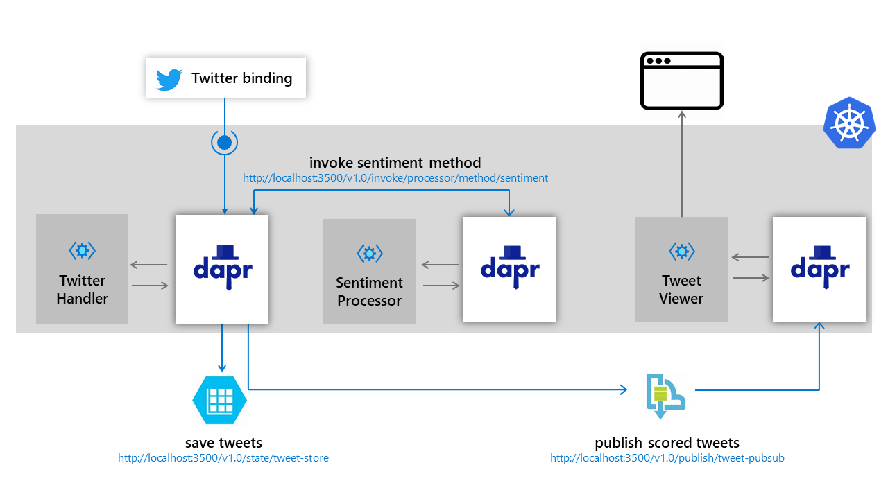
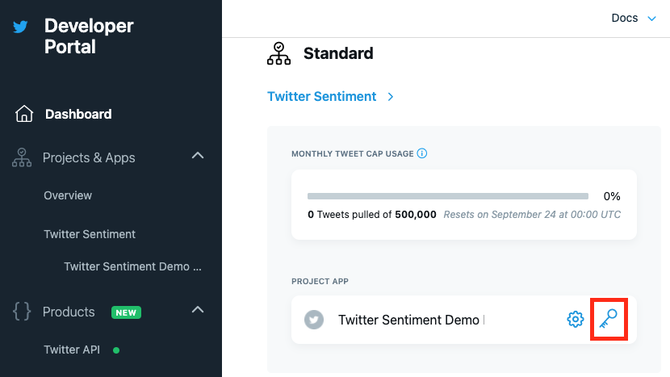
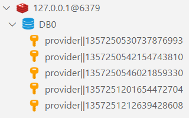
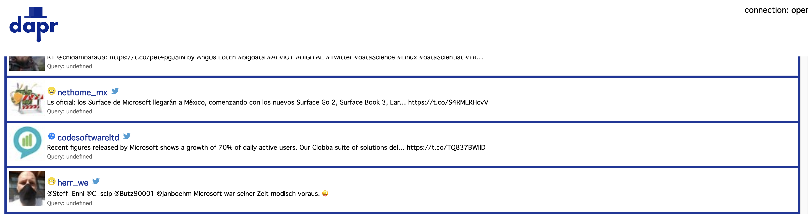
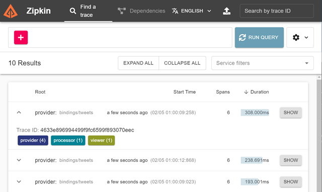
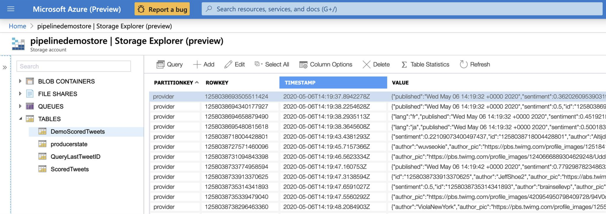

# Twitter Sentiment Processor

This demo shows just how easy it is to setup a local development environment with [Dapr](https://dapr.io) and transition your work to the cloud.

To simulate the transition from local development to the cloud this demo has three stages demos 1-3.

* **Demo 1** - local development showing the speed with which developers can start and use the Dapr components (Twitter and state)
* **Demo 2** - expands on Demo 1 adding monitoring and service invocation using both, direct invocation and consumption of events across applications using PubSub
* **Demo 3** - deploys the application into Kubernetes on Azure and showcases the pluggability of components by switching the state to Azure Table Storage and PubSub to Azure Service Bus without making any code changes

## Sample info

| Attribute | Details |
|--------|--------|
| Dapr runtime version | v1.3.0 |
| Language | Go, C# (.NET Core 3.1), Node.js |
| Environment | Local or Kubernetes |

>Note: this demo uses Dapr v1.3.0 and may break if different Dapr versions are used



> All the demos rely on the Dapr Twitter input binding. For that binding to work you must have a [Twitter Developer Account](https://developer.twitter.com/en/apply-for-access) and you must add your [Twitter API credentials](https://developer.twitter.com/en/docs/basics/getting-started) to `components/twitter.yaml`:

  ```yaml
    apiVersion: dapr.io/v1alpha1
    kind: Component
    metadata:
      name: tweets
    spec:
      type: bindings.twitter
      version: v1
      metadata:
        # PLACE TWITTER CREDENTIALS HERE
        metadata:
        - name: consumerKey
          value: "" # twitter api consumer key, required
        - name: consumerSecret
          value: "" # twitter api consumer secret, required
        - name: accessToken
          value: "" # twitter api access token, required
        - name: accessSecret
          value: "" # twitter api access secret, required
        - name: query
          value: "microsoft" # your search query, required
  ```
> Note: You must generate your consumer keys and your access token / secret separately from each other. You can find this information in the `Keys and Token` section of your project app. The easiest way to get there is from your [Twitter Developer Dashboard](https://developer.twitter.com/en/portal/dashboard) and click on the `key` icon under the project app. 

> If you do not have a project app, you will need to create one before you can generate keys.



## Demo 1

This demo contains two versions of the same application one C# .NET Core (`provider-net`) and Node.js (`provider`) using the dapr Twitter input binding component to subscribe to Twitter search results. This application uses the default Redis `statestore` to persist each tweet.

### Demo 1 Objectives (Node.js)

The goal of this demo is to show how quickly you can get an application running with Dapr.

* Show idiomatic experience in Dapr allowing developers to be effective Day 1 (no Dapr libraries or attributes in user code)
* Introduce the concept of components as a way to leverage existing capabilities (Twitter Binding and Redis state store)

### Demo 1 Requirements (Node.js)

* Docker
* Node.js
* Dapr CLI v1.3.0
* [Twitter API credentials](https://developer.twitter.com/en/docs/basics/getting-started)

### Run Demo 1 (Node.js)

Starting from the provider folder of demo 1 (`demos/demo1/provider`)

* Install [Dapr CLI](https://docs.dapr.io/getting-started/install-dapr/#install-the-dapr-cli)

* Initialize Dapr

  ```bash
  dapr init --runtime-version '1.3.0'
  ```

* Launch app locally using Dapr by running `run.sh` for Bash or `run.ps1` for PowerShell

  ```bash
  ./run.sh
  ```

This will issue the `dapr run` command to launch Dapr and your application locally. Wait for tweets with the word `microsoft` to begin to arrive. In the terminal you will see logs from both Dapr and your application. As each tweet arrives you will see additional logging information appear.

You can use a Visual Studio Code [extension](https://marketplace.visualstudio.com/items?itemName=cweijan.vscode-mysql-client2) to view the data in Redis.



### Demo 1 Objectives (dotnet)

This is the same application written in C# and leveraging the Dapr SDK. This highlights the flexibility to use Dapr with any language.

* Show idiomatic experience in Dapr allowing developers to be effective Day 1 (uses optional SDK)
* Introduce the concept of components as a way to leverage existing capabilities (Twitter Binding and Redis state store)

### Demo 1 Requirements (dotnet)

* Docker
* [.NET Core 3.1](http://bit.ly/DownloadDotNetCore)
* Dapr CLI v1.3.0
* [Twitter API credentials](https://developer.twitter.com/en/docs/basics/getting-started)

> Note .NET Core 3.1 is required. You can install along side .NET 5.0

### Run Demo 1 (dotnet)

Starting from the provider-net folder of demo 1 (`demos/demo1/provider-net`)

* Install [Dapr CLI](https://docs.dapr.io/getting-started/install-dapr/#install-the-dapr-cli)
* Run

  ```powershell
  dapr init --runtime-version '1.3.0'
  ```

* Launch app locally using Dapr by running `run.sh` for Bash or `run.ps1` for PowerShell

  ```powershell
  ./run.ps1
  ```

This will launch Dapr and your application locally. Wait for tweets with the word `microsoft` to begin to arrive. In the terminal you will see logs from both Dapr and your application. As each tweet arrives you will see additional logging information appear.

You can use a Visual Studio Code [extension](https://marketplace.visualstudio.com/items?itemName=cweijan.vscode-mysql-client2) to view the data in Redis.


## Demo 2

Demo 2 builds on demo 1 adding service-to-service invocation between multiple microservices in Dapr (`processor` being invoked by `provider`). The use of the state store is replaced with PubSub, where each scored tweet is published onto a topic where it will be read by the viewer app. This demo also includes a Go viewer app (`viewer`) which subscribes to a PubSub `tweet-pubsub` topic and streams scored tweets over WebSockets to a SPA in JavaScript for display.

### Demo 2 Objectives

All the applications at this stage run locally.

* Builds on Demo 1, illustrate interaction between multiple microservices in Dapr
* Introduces service to service discovery/invocation
* Introduces eventing using Dapr PubSub component
* Introduces monitoring using Zipkin

### Demo 2 Requirements

* Go v1.4
* Node.js
* [Azure CLI v2.18.0](https://docs.microsoft.com/cli/azure/install-azure-cli)
* Dapr CLI v1.3.0
* [Azure Account](https://azure.microsoft.com/free/)
* [Cognitive Services account](https://docs.microsoft.com/azure/cognitive-services/cognitive-services-apis-create-account)
* [Twitter API credentials](https://developer.twitter.com/en/docs/basics/getting-started)

### Run demo 2

Starting from the root of demo 2 (`demos/demo2`) make sure you are logged into Azure.

  ```bash
  az login
  ```

Set the desired subscription.

  ```bash
  az account set --subscription <id or name>
  ```

 Now we can deploy the required infrastructure by running `setup.sh` for Bash or `setup.ps1` for PowerShell. When calling `setup.sh` you must use the `source` command so the environment variables are properly set (this is not required for the PowerShell version). These scripts will run an Azure Resource Manager template deployment that will deploy a  Cognitive Services account and set the required CS_TOKEN and CS_ENDPOINT environment variables for the `processor` application. The scripts take two arguments.

1. resource group name: This will be the resource group created in Azure. If you do not provide a value `twitterDemo` will be used.
1. location: This is the location to deploy all your resources. If you do not provide a value `eastus` will be used.

Bash

  ```bash
  source ./setup.sh myDemo westus2
  ```

PowerShell

```powershell
./setup.ps1 myDemo westus2
```

The results should look similar to this:

```bash
You can now run the processor from this terminal.
```

Start `processor` so it's ready when `provider` starts

```bash
cd processor
./run.sh
```

Start `viewer` so it's ready when `provider` starts

```bash
cd viewer
./run.sh
```

Navigate to the viewer UI in browser (make sure WebSockets connection is opened)

[http://localhost:8083](http://localhost:8083)

Start `provider`

> For demo purposes use a frequently tweeted about topic, like microsoft (the default value). You may change the search term in the [demos/components/twitter.yaml](demos/components/twitter.yaml) file under `query` metadata element **BEFORE** you start provider

```bash
cd provider
./run.sh
```

Switch back to the UI to see the scored tweets

[http://localhost:8083](http://localhost:8083)

The UI should look something like this



This demo also shows monitoring via Zipkin. You can view the trace data of a tweet being processed by visiting [http://localhost:9411](http://localhost:9411). Click `Run Query` to see the captured traces.



## Demo 3

Demo 3 takes the local development work and moves it to Kubernetes in Azure and all the components are configured to point to Azure based resources. The required Docker images have already been uploaded to Docker Hub for you.

### Demo 3 Objectives

* Show deployment of locally developed artifacts onto Kubernetes
* Illustrate the run-time portability and component pluggability

### Demo 3 Requirements

* Go v1.4
* Node.js
* [Helm v3](https://helm.sh/)
* [Azure CLI v2.18.0](https://docs.microsoft.com/cli/azure/install-azure-cli)
* Dapr CLI v1.3.0
* [Azure Account](https://azure.microsoft.com/free/)
* [Cognitive Services account](https://docs.microsoft.com/azure/cognitive-services/cognitive-services-apis-create-account)
* [Twitter API credentials](https://developer.twitter.com/en/docs/basics/getting-started)

### Run demo 3

> Assumes the use of pre-built images for [provider](https://hub.docker.com/repository/docker/darquewarrior/provider), [processor](https://hub.docker.com/repository/docker/darquewarrior/processor), and [viewer](https://hub.docker.com/repository/docker/darquewarrior/viewer)

> Assumes Dapr Twitter input binding has been configured. For that binding to work you must add your Twitter API credentials to components/twitter.yaml. For more information, checkout [the sample-info](#sample-info) section.

Starting from the root of demo 3 (`demos/demo3`) make sure you are logged into Azure.

  ```bash
  az login
  ```

Set the desired subscription.

  ```bash
  az account set --subscription <id or name>
  ```

 Now we can deploy the required infrastructure by running `setup.sh` for Bash or `setup.ps1` for PowerShell. Unlike with demo 2 you **do not** have to use the `source` command to run the Bash script as no environment variables are set. These scripts will run an Azure Resource Manager template deployment and a Helm install to deploy the entire demo. The scripts take three arguments.

1. resource group name: This will be the resource group created in Azure. If you do not provide a value `twitterDemo` will be used.
2. location: This is the location to deploy all your resources. If you do not provide a value `eastus` will be used.
3. runtime version: This is the runtime version of Dapr to deploy to the cluster. If you do not provide a value `1.3.0` will be used.
4. kubernetes version: This is the version of Kubernetes control plane. If you do not provide a value, the latest Kubernetes version available for the provided location will be used.

Bash

  ```bash
  ./setup.sh myDemo westus2 '1.3.0' '1.21.2'
  ```

PowerShell

```powershell
./setup.ps1 myDemo westus2 '1.3.0' '1.21.2'
```

The results should look similar to this:

```bash
Getting IP addresses. Please wait...

Your app is accessible from http://52.167.250.162
Zipkin is accessible from http://52.247.23.115
```

#### Observability

You can view the scored tweets in Azure table storage. From your resource group click on your storage account. From the left navigation select `Storage Explorer (preview)`. Expand `TABLES` and click `DemoScoredTweets`.



Similarly you can monitor the PubSub topic throughout in Azure Service Bus. From your resource group click on your service bus namespace. From the left navigation select `Topics`. Click the `scored` topic.


In addition to the state and PubSub, you can also observe application traces in Zipkin. The URL to Zipkin is output at the end of the setup script.


## Recordings

View the [recorded session](https://mybuild.microsoft.com/sessions/3f296b9a-7fe8-479b-b098-a1bfc7783476?source=sessions) and the [demo recordings](https://youtu.be/qejiWzy5etA)
