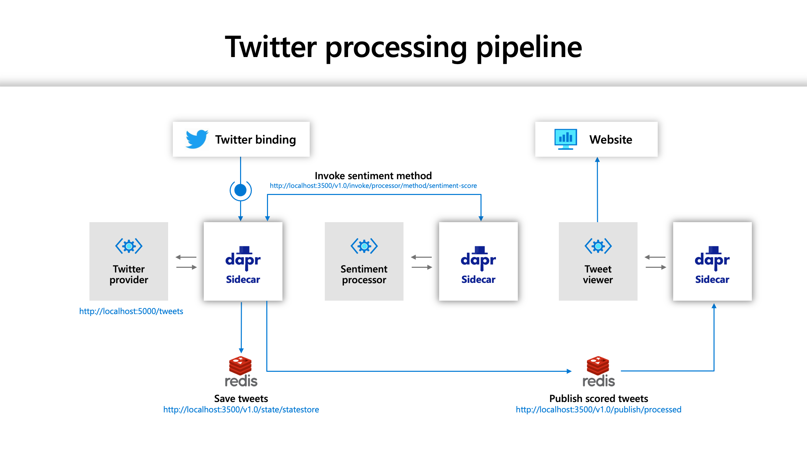
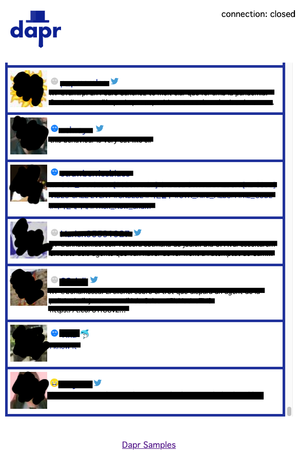

# Twitter Sentiment Processor

>Note: this demo uses Dapr v0.11.3 and may break if different Dapr versions are used

## Sample info
| Attribute | Details |
|--------|--------|
| Dapr runtime version | v0.11.3 |
| Dapr Java SDK version | v0.9.2 |
| Language | Java |
| Environment | Local |

## Overview

This demo is an implementation of the Twitter Processing Pipeline demo in Java, using Dapr's Java SDK. The purpose of this demo is to showcase Dapr in Java.



## Requirements

* Java 11 or above.
* Apache Maven 3.6 or above.
* [Twitter API credentials](https://developer.twitter.com/en/docs/basics/getting-started)
* Endpoint and Key for [Azure's Text Analytics](https://azure.microsoft.com/en-us/services/cognitive-services/text-analytics/) in Azure Cognitive Services.

Twitter credentials will have to set in a new file `provider/secrets.json`:

```json
{
  "Twitter": {
    "ConsumerKey": "xxxxxxxx",
    "ConsumerSecret": "xxxxxxxxxx",
    "AccessToken": "xxxxxxxxx",
    "AccessSecret": "xxxxxxxxx"
  }
}
```

Endpoint and Key for Azure's Text Analytics will have to set in a new file `processor/secrets.json`:

```json
{
  "Azure": {
    "CognitiveServices": {
      "Endpoint": "https://xxxxxxxx.cognitiveservices.azure.com/",
      "SubscriptionKey": "xxxxxxxxxxx"
    }
  }
}
```

## Understanding the Pipeline

All the applications described here uses Spring Boot.

### Provider

Provider service will receive Twitter feeds, invoke the processor application above, then save the results to state store and finally publishes to a topic. This application uses multiple Dapr building blocks:

* Bindings - is used to receive Twitter feed as defined in [provider/components/binding.yaml](provider/components/binding.yaml)
* Secret Store - is used to serve secrets to the Twitter feed config, see it defined in [provider/components/secretstore.yaml](provider/components/secretstore.yaml)
* Service Invocation - is used to invoke the sentiment analysis API in the Processor application defined later on.
* State Store - is used to save tweets to Redis, as defined in [provider/components/statestore.yaml](provider/components/statestore.yaml)
* Pub Sub - is used to publish tweets to be consumed by the Web UI. PubSub is defined in [provider/components/pubsub.yaml](provider/components/pubsub.yaml)

The controller is implemented in [ApplicationController.java](provider/src/main/java/io/dapr/apps/twitter/processor/ApplicationController.java). It receives a tweet via input binding, then uses Service Invocation to get the sentiment analysis for the Tweet's text, saves the analyized tweet into the state store and, finally, publishes it to a PubSub topic.

### Processor

Processor service will receive a text and a language code and invoke Azure's Text Analytics to extract the sentiment and score for the text. If the analysis cannot be done, it will return `unknown` sentiment with a score of `0`. It only uses secret store from Dapr's building blocks, as seen in [processor/components/secretstore.yaml](processor/components/secretstore.yaml).

The controller is implemented in [ApplicationController.java](processor/src/main/java/io/dapr/apps/twitter/processor/ApplicationController.java). It does not include any Dapr specific code, it simply invokes the Azure Cognitive Services API and returns a sentiment score. The only class that makes this application use Dapr is [DaprConfig.java](processor/src/main/java/io/dapr/apps/twitter/processor/DaprConfig.java), since it is used to inject the secrets needed for the communication to the Azure Cognitive Services API.

### Viewer

Viewer app runs a static website from the [viewer/src/main/resources/static](viewer/src/main/resources/static) folder. The website stablishes a Web Socket connection to the `/ws/` endpoint. The server side for the Web Socket is handled by [SocketTextHandler.java](viewer/src/main/java/io/dapr/apps/twitter/viewer/SocketTextHandler.java). The PubSub subscription is handled by [ApplicationController.java](viewer/src/main/java/io/dapr/apps/twitter/processor/ApplicationController.java), using a singleton instance of [WebSocketPubSub.java](viewer/src/main/java/io/dapr/apps/twitter/processor/WebSocketPubSub.java) to send the topic's message to all active Web Sockets.

## Running

First, run the processor app, using `sentiment-processor` as the app id:

```sh
cd processor
mvn clean install
dapr run --app-id sentiment-processor --components-path=./components/ --app-port=8081 -- java -jar target/app.jar
```

In another terminal, run the provider app:

```sh
cd provider
mvn clean install
dapr run --components-path=./components/ --app-port=8080 -- java -jar target/app.jar
```

Finally, open another terminal and run the web UI app:

```sh
cd viewer
mvn clean install
dapr run --components-path=./components/ --app-port=8088 -- java -jar target/app.jar
```

Now, open the browser on [http://localhost:8088/](http://localhost:8088/). You should see a web UI like this:



Thanks.
