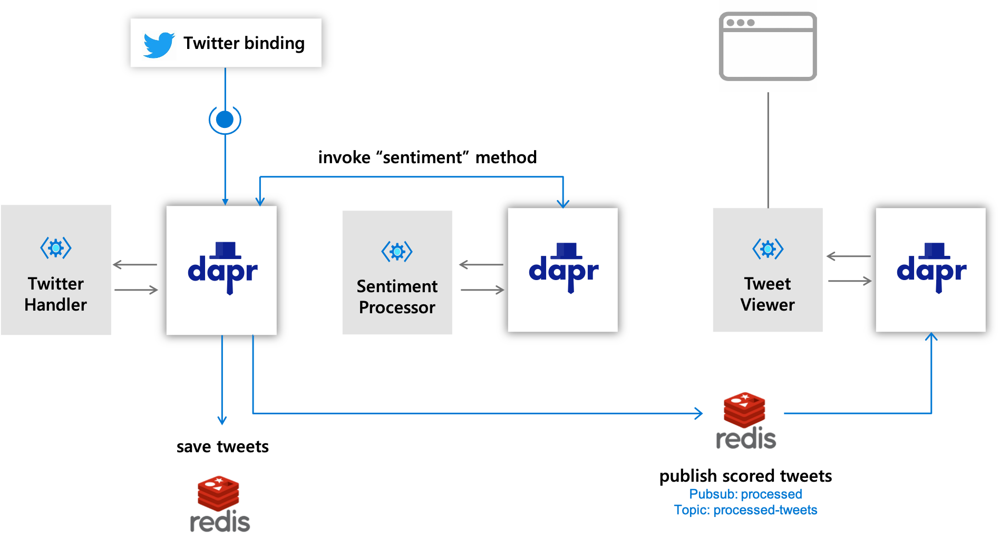
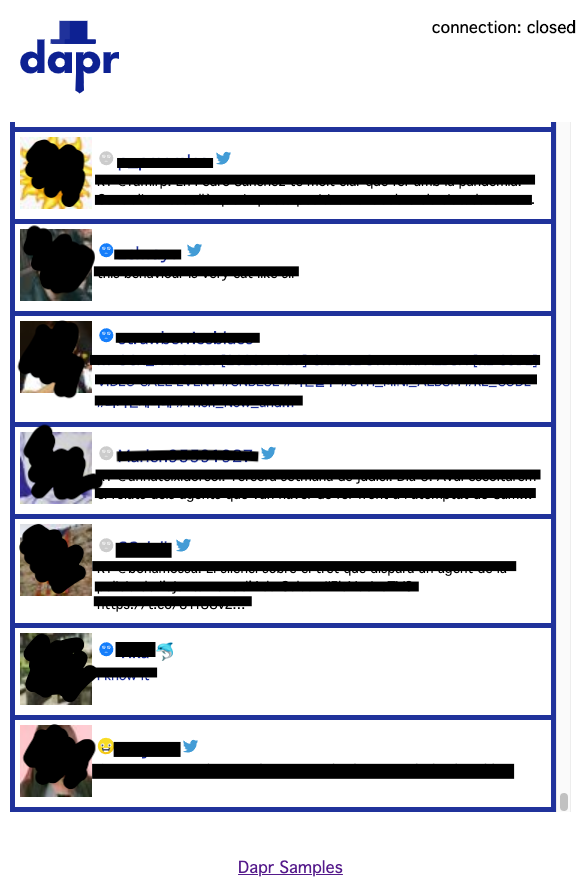

# Twitter Sentiment Processor

## Sample info

| Attribute | Details |
|--------|--------|
| Dapr runtime version | v1.0.0+ |
| Dapr Python SDK | v1.0.0+ |
| Language | Python |
| Environment | Local |

## Overview

This demo is an implementation of the Twitter Processing Pipeline demo in Python, using Dapr's Python SDK. The purpose of this demo is to showcase Dapr in Python.



## Requirements

* Python 3.7+
* [Twitter API credentials](https://developer.twitter.com/en/docs/basics/getting-started)
* API Key for [Text Analytics](https://azure.microsoft.com/en-us/services/cognitive-services/text-analytics/) in Azure Cognitive Services.

Set Twitter and Azure Cognitive Services credentials in the secrets file [local_secrets.json](./local_secrets.json):

```json
{
    "Twitter": {
        "ConsumerKey": "",
        "ConsumerSecret": "",
        "AccessToken": "",
        "AccessSecret": ""
    },
    "Azure": {
        "CognitiveAPIEndpoint": "https://<service_name>.cognitiveservices.azure.com/",
        "CognitiveAPIKey": "<Service Api Key>"
    }
}
```

## Undersanding the Pipeline

### Provider

Provider service will receive Twitter feeds, invoke the processor application above, then save the results to state store and finally publishes to `processed-tweets` topic.

#### Used building blocks

* Binding - is used to receive Twitter feed as defined in [provider/components/twitter_binding.yaml](provider/components/twitter_binding.yaml)
* Secret Store - is used to serve secrets to the Twitter feed config, see it defined in [provider/components/secretstore.yaml](provider/components/secretstore.yaml)
* Service Invocation - is used to invoke the sentiment analysis API in the Processor application defined later on.
* State Store - is used to save tweets to Redis, as defined in [provider/components/statestore.yaml](provider/components/statestore.yaml)
* Pub Sub - is used to publish tweets to be consumed by the Web UI. PubSub is defined in [provider/components/pubsub.yaml](provider/components/pubsub.yaml)


### Processor

Processor service exposes `sentiment-score` method which `Provider` service to invoke via service invocation. This receives a text and a language code from tweet payload and extract the sentiment and score for the text via Azure cognitive service.

#### Used building blocks

* Secret Store - is used to serve secrets to the Twitter feed config, see it defined in [processor/components/secretstore.yaml](processor/components/secretstore.yaml)


### Viewer

Viewer app is a Flask web application serving web service. [flask-SocketIO](https://flask-socketio.readthedocs.io/en/latest/) is used to enable real-time update tweets on the web page. This creates subscription to `processed-tweets` topic and broadcast tweet message from the topic to webpage via [socket.io](https://socket.io/)

#### Used building blocks

* Pub Sub - is used to subscribe to `processed-tweets` topic. tweets can be displayed on the tweet sentiment on webpage. PubSub is defined in [viewer/components/pubsub.yaml](viewer/components/pubsub.yaml)


## Running

First, run the processor app:

```sh
cd processor
pip3 install -r requirements.txt
dapr run \
    --app-id tweet-processor \
    --app-port 3002 \
    --app-protocol grpc \
    --components-path ./components \
    python3 processor.py
```

In another terminal, run the provider app:

```sh
cd provider
pip3 install -r requirements.txt
dapr run \
    --app-id tweet-provider \
    --app-port 3001 \
    --app-protocol grpc \
    --components-path ./components \
    python3 provider.py
```

Finally, open another terminal and run the web UI app:
```sh
cd viewer
pip3 install -r requirements.txt
dapr run \
    --app-id tweet-viewer \
    --app-port 8083 \
    --app-protocol http \
    --components-path ./components \
    python3 viewer-server.py
```

Now, open the browser on [http://localhost:8083/](http://localhost:8083/). You should see a web UI like this:


