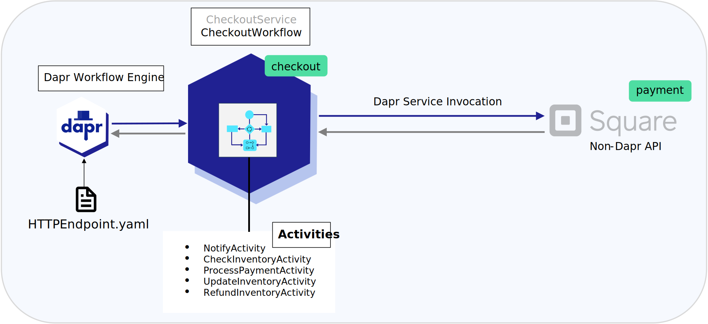

# Dapr Workflow with Service Invocation to Non-Dapr Endpoint

## Sample info

| Attribute | Details |
|--------|--------|
| Dapr runtime version | 1.11.0 |
| Language | C# |
| Environment | Local |

An example of using Dapr Workflows with the new feature for invoking non-Dapr enabled endpoints



## Prerequisites

1. [.NET 7 SDK](https://dotnet.microsoft.com/download/dotnet/7.0)
1. [Dapr CLI](https://docs.dapr.io/getting-started/install-dapr-cli/)
   - Ensure that you're using **v1.11** of the Dapr runtime and the CLI, since there have been [breaking changes](https://github.com/dapr/dapr/pull/6218) to the Workflow API from v1.10 to v1.11.
1. A REST client, such as [cURL](https://curl.se/), or the VSCode [REST client extension](https://marketplace.visualstudio.com/items?itemName=humao.rest-client) (recommended).
1. [Square Developer account](#setting-up-your-connection-to-square-developer-sandbox-apis)

### Setting up your connection to Square Developer Sandbox APIs

1. Navigate to the [Square Developer](https://developer.squareup.com/us/en) website and click "Get started"
1. If you don't already have an account, select "Sign up". Otherwise, enter existing credentials.
1. Add a new application and call it `workflow-payment-app` or select your own unique identifier.
1. Select "Skip" on the subsequent blades.
1. On the Credentials page, ensure `Sandbox` is selected in the top slider > find `Sandbox Access token` > Click "show" > Copy the Access Token value.
1. Navigate to the directory titled "Resources" and select the "httpEndpoint.yaml" file. Replace `{SQUARE_SANDBOX_TOKEN}` with the API token retrieved.
1. Return to the Square Developer portal and underneath the `Sandbox Access Token` section referenced above, copy the value for `Sandbox API version` and replace `{SQUARE_API_VERSION}` in the "httpEndpoint.yaml" manifest.

Once you have completed the above steps, you are ready to connect to the Square Payment API from your Dapr Workflow!

> NOTE: The application code calls out to the Square Payment API and will randomly select a failing test card or a successful test card to simulate various workflow paths.

### Run the Workflow

## VS Code Debugger

Navigate to the `Run and Debug` tab and select `Debug Checkout`. This will launch the CheckoutService application along with the Dapr sidecar and attach a debugger.

## CLI

1. Navigate to the `CheckoutService` directory and build the ASP.NET app:

   ```bash
   cd CheckoutService
   dotnet build
   ```

2. Run the app using the Dapr CLI:

   ```bash
   dapr run --app-id checkout --app-port 5000 --dapr-http-port 3500 --resources-path ../Resources dotnet run
   ```

   > Ensure the --app-port is the same as the port specified in the launchSettings.json file.

3. Start the `CheckoutWorkflow` by sending a cURL request to the Workflow API, or use the [test.rest](test.rest) file if you are using VSCode with the REST client:

   ```bash
   curl -i -X POST http://localhost:3500/v1.0-alpha1/workflows/dapr/CheckoutWorkflow/start?instanceID=1234a \
     -H "Content-Type: application/json" \
     -d '{ "Name": "TestUser", "OrderItem": { "Name": "item1", "Quantity": 4 }}'
   ```

   > Note that `1234a` in the URL is the workflow instance ID. This can be any string you want.

   Expected result:

   ```json
   {
     "instanceID": "<WORKFLOW_ID>"
   }
   ```

4. Check the workflow status via Workflow HTTP API:

   ```bash
   curl -i -X GET http://localhost:3500/v1.0-alpha1/workflows/dapr/1234a
   ```

   The Workflow should either be "COMPLETED" with a "Payment Failed" custom status:

   ```json
   {
     "instanceID": "50b8ce61-e6b3-416d-a33e-3cec1e7bed1f",
     "workflowName": "CheckoutWorkflow",
     "createdAt": "2023-07-29T01:29:34.337735Z",
     "lastUpdatedAt": "2023-07-29T01:29:44.973235Z",
     "runtimeStatus": "COMPLETED",
     "properties": {
       "dapr.workflow.custom_status": "\"Payment failed\"",
       "dapr.workflow.input": "{ \"Name\": \"TestUser\", \"OrderItem\": { \"Name\": \"Item1\", \"Quantity\": 4 } }",
       "dapr.workflow.output": "{\"Processed\":false}"
     }
   }
   ```

   OR "COMPLETED" with a "Payment Succeeded" message:

   ```json
   {
     "instanceID": "176da304-38ea-4691-9b48-752a2f0a18ef",
     "workflowName": "CheckoutWorkflow",
     "createdAt": "2023-07-29T01:40:03.069401Z",
     "lastUpdatedAt": "2023-07-29T01:40:18.946546Z",
     "runtimeStatus": "COMPLETED",
     "properties": {
       "dapr.workflow.custom_status": "\"Checkout completed\"",
       "dapr.workflow.input": "{ \"Name\": \"TestUser\", \"OrderItem\": { \"Name\": \"Item1\", \"Quantity\": 4 } }",
       "dapr.workflow.output": "{\"Processed\":true}"
     }
   }
   ```
