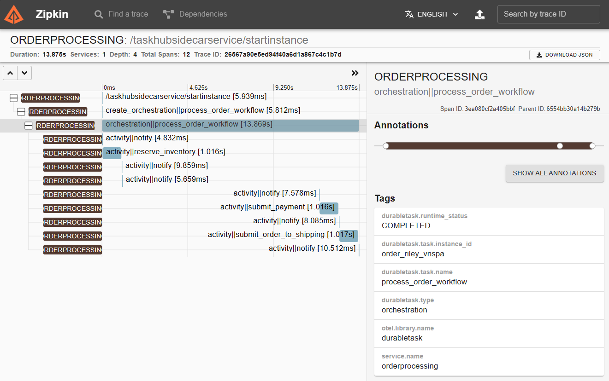
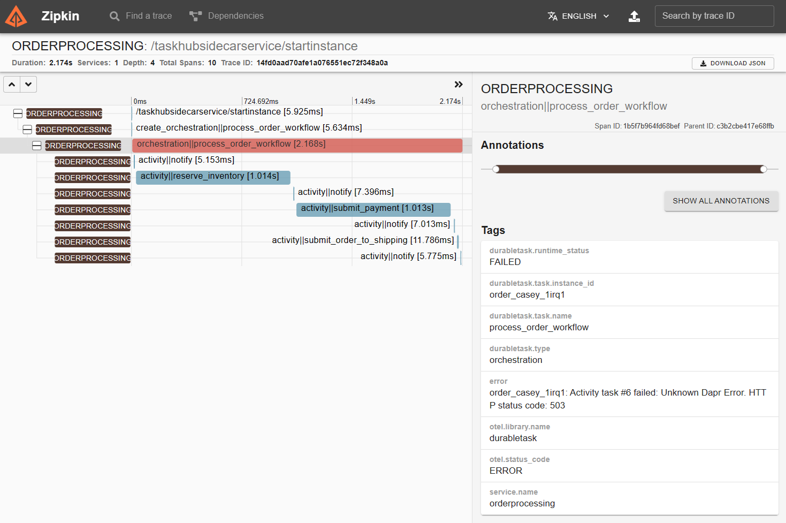

# Dapr Workflow Order Processing Microservice Sample

## Sample info

| Attribute | Details |
|--------|--------|
| Dapr runtime version | 1.12.0 |
| Dapr Workflow Python SDK | v0.2.0 |
| Language | Python |
| Environment | Local |

An example of using [Dapr Workflows](https://docs.dapr.io/developing-applications/building-blocks/workflow/) to build a microservice architecture for order processing using Python. This example uses pub/sub and service invocation building blocks.

## Overview

This sample is comprised of five microservices:

- **[orderprocessing](./services/orderprocessing/)**: The main entrypoint for the sample. This service receives an order request and starts a new Dapr Workflow instance to process the order.
- **[notifications](./services/notifications/)**: A service receives pub/sub messages from the orderprocessing service and displays  notifications to the user.
- **[inventory](./services/inventory/)**: A service for managing inventory that is invoked by the orderprocessing workflows.
- **[payments](./services/payments/)**: A service for managing payments that is invoked by the orderprocessing workflows.
- **[shipping](./services/shipping/)**: A service for managing shipping that is invoked by the orderprocessing workflows.

The order processing workflow and all services are written in Python. Orders are submitted through a Flask REST API in the orderprocessing service, which triggers a workflow instance to process the order. As the workflow progresses, it uses pub/sub to send notifications to the notifications service, and service invocation to invoke the inventory, payments, and shipping services.

Orders that are $1,000 or more must be approved by a designated approver within 24 hours, otherwise the order will be cancelled. The workflow will automatically pause execution to wait for the approval using the [external workflow event](https://docs.dapr.io/developing-applications/building-blocks/workflow/workflow-features-concepts/#external-events) APIs. Approvals can be submitted through the Flask REST API in the orderprocessing service.

## Prerequisites

1. Python 3.8+
1. [Dapr CLI](https://docs.dapr.io/getting-started/install-dapr-cli/)
   - Ensure that you're using **v1.12** of the Dapr runtime and the CLI.
1. A REST client, such as [cURL](https://curl.se/), or the VSCode [REST client extension](https://marketplace.visualstudio.com/items?itemName=humao.rest-client) (recommended).

## Setting up the Python environment

It's recommended to create a virtual environment for the sample. This can be done using the `venv` module in Python 3.8+. You can then install the dependencies for each of the microservices.

1. Create a virtual environment for the sample:

   ```sh
   python3 -m venv .venv
   ```

1. Activate the virtual environment:

   ```sh
    source .venv/bin/activate
    ```

1. Install the dependencies for each of the microservices under the `services` directory:

    ```sh
    pip install -r services/orderprocessing/requirements.txt
    pip install -r services/notifications/requirements.txt
    pip install -r services/inventory/requirements.txt
    pip install -r services/payments/requirements.txt
    pip install -r services/shipping/requirements.txt
    ```

## Running the sample

The full microservice architecture can be run locally using the [Multi-App Run](https://docs.dapr.io/developing-applications/local-development/multi-app-dapr-run/) feature of the Dapr CLI. The multi-app configuration is defined in the [dapr.yaml](./dapr.yaml) file.

1. To start all the services, navigate to the root directory of the sample and run the following command:

    ```sh
    dapr run -f .
    ```

1. Next, navigate to the notification service web UI at http://localhost:3001 to view the notifications from workflows. Keep this page open while running the sample.

1. Submit an order using the following cURL command, or via the [demo.http](./demo.http) file if you are using VSCode with the REST client, to start a new order processing workflow that requires approval (if using PowerShell, replace `\` with `` ` ``):

    ```sh
    curl -i -X POST http://localhost:3000/orders \
        -H "Content-Type: application/json" \
        -d '{"customer": "Riley", "items": ["milk", "bread", "iPhone"], "total": 1299.00}'
    ```

   Expected result (abbreviated):

    ```http
    HTTP/1.1 202 ACCEPTED
    Location: http://localhost:3000/orders/order_riley_o066i
    Content-Type: text/html; charset=utf-8
    Content-Length: 40

    Order received. ID = 'order_riley_o066i'
    ```

   > **NOTE**: `order_riley_o066i` in the response is the order ID. The exact value is random and will be different for each order. In each subsequent example, replace `order_riley_o066i` with the order ID returned from the previous request.

   > **NOTE**: If you want to submit an order the is auto-approved, simply change the `total` value to be less than `1000`.

1. Check the status of the order by sending a GET request to the URL in the `Location` header of the previous response:

   ```http
   curl -i http://localhost:3000/orders/order_riley_o066i
   ```

    Expected result (formatted for readability):
    
    ```json
    {
      "created_time": "2023-10-28T17:02:05.137170",
      "details": {
        "customer": "Riley",
        "id": "order_riley_o066i",
        "items": ["milk", "bread", "iPhone"],
        "total": 1299.0
      },
      "id": "order_riley_o066i",
      "last_updated_time": "2023-10-28T17:02:05.222644",
      "status": "RUNNING"
    }
    ```

1. Check the notifications web UI at http://localhost:3001 to see the notifications from the workflow. They should look something like this:

    ```text
    2023-10-28T10:02:05-07:00 | order_riley_o066i | Received order for Riley: ['milk', 'bread', 'iPhone']. Total = 1299.0
    2023-10-28T10:02:05-07:00 | order_riley_o066i | Reserved inventory for order: ['milk', 'bread', 'iPhone']
    2023-10-28T10:02:05-07:00 | order_riley_o066i | Waiting for approval since order >= 1000.0. Deadline = 2023-10-29 17:02:05.
    ```

1. Approve the order by sending a POST request to the approval endpoint:

    ```sh
    curl -i -X POST http://localhost:3000/orders/order_riley_o066i/approve  \
        -H "Content-Type: application/json" \
        -d '{"approver": "Chris", "approved": true}'
    ```

    > **NOTE**: You can alternatively reject the order by specifying `"approved": false` in the request body.
    
    Expected result (abbreviated):
    
    ```http
    HTTP/1.1 200 OK
    Content-Type: text/html; charset=utf-8
    Content-Length: 42

    Approval sent for order: order_riley_o066i
    ```

1. Check the status of the workflow again to confirm that it completed successfully:

    ```sh
    curl -i http://localhost:3000/orders/order_riley_o066i
    ```

    Expected result (formatted for readability):
    
    ```json
    {
      "created_time": "2023-10-28T17:02:05.137170",
      "details": {
        "customer": "Riley",
        "id": "order_riley_o066i",
        "items": ["milk", "bread", "iPhone"],
        "total": 1299.0
      },
      "id": "order_riley_o066i",
      "last_updated_time": "2023-10-28T17:10:02.716316",
      "order_result": {
        "id": "order_riley_o066i",
        "message": "Order processed successfully",
        "success": true
      },
      "status": "COMPLETED"
    }
    ```

1. Check the notifications web UI again to see the updated notifications from the workflow. They should look something like this:

    ```text
    2023-10-28T10:02:05-07:00 | order_riley_o066i | Received order for Riley: ['milk', 'bread', 'iPhone']. Total = 1299.0
    2023-10-28T10:02:05-07:00 | order_riley_o066i | Reserved inventory for order: ['milk', 'bread', 'iPhone']
    2023-10-28T10:02:05-07:00 | order_riley_o066i | Waiting for approval since order >= 1000.0. Deadline = 2023-10-29 17:02:05.
    2023-10-28T10:10:00-07:00 | order_riley_o066i | Order was approved by Chris.
    2023-10-28T10:10:01-07:00 | order_riley_o066i | Payment was processed successfully
    2023-10-28T10:10:02-07:00 | order_riley_o066i | Order submitted for shipping
    ```

1. Check the Zipkin UI at http://localhost:9411. Click "Run Query" to list the recently captured traces and then select the most recent, which should have a span of several seconds. The resulting UI should look something like this:

   

   > **NOTE**: This screenshot shows a different order processing workflow instance ID than the one used in this example.

   > **NOTE**: When the `orchestration||process_order_workflow` span is selected, you can click the "SHOW ALL ANNOTATIONS" button to see more information about the workflow, including the specific time that the order was approved.

1. To stop all the services, press `Ctrl+C` in the terminal where the services are running.

If you want to exercise the error handling path of the workflow, you can put the shipping service in "maintainance mode" and then try to submit another order.

1. Put the shipping service in "maintainance mode" by sending a POST request to the `/shipping/deactivate` endpoint:

    ```sh
    curl -i -X POST http://localhost:3004/shipping/deactivate
    ```

1. Start a new order processing workflow. For simplicity, we'll start an order with a smaller cost that can be auto-approved.

    ```sh
    curl -i -X POST http://localhost:3000/orders \
        -H "Content-Type: application/json" \
        -d '{"customer": "Casey", "items": ["milk", "bread"], "total": 10.00}'
    ```

1. Check the notifications web UI to see the notifications for this new workflow. It should look something like this:

    ```text
    2023-10-28T10:46:19-07:00 | order_casey_1irq1 | Received order for Casey: ['milk', 'bread']. Total = 10.0
    2023-10-28T10:46:20-07:00 | order_casey_1irq1 | Reserved inventory for order: ['milk', 'bread']
    2023-10-28T10:46:21-07:00 | order_casey_1irq1 | Payment was processed successfully
    2023-10-28T10:46:21-07:00 | order_casey_1irq1 | Error submitting order for shipping: order_casey_1irq1: Activity task #6 failed: Unknown Dapr Error. HTTP status code: 503
    ```

    > **NOTE**: There is currently a bug in the v0.2.0 release of the Dapr Workflow Python SDK that causes the workflow to fail earlier than it's supposed to, resulting in the refund activity not running. This bug will be fixed in a future release of the SDK.

1. You can also check the status of the workflow using the REST API to see that the order is in the failed state.

    ```
    curl -i http://localhost:3000/orders/order_casey_1irq1
    ```

    Expected result (formatted for readability):

    ```json
    {
      "created_time": "2023-10-28T17:46:19.031582",
      "details": {
        "customer": "Casey",
        "id": "order_casey_1irq1",
        "items": ["milk", "bread"],
        "total": 10.0
      },
      "failure_details": {
        "error_type": "TaskFailedError",
        "message": "order_casey_1irq1: Activity task #6 failed: Unknown Dapr Error. HTTP status code: 503",
        "stack_trace": "..."
      },
      "id": "order_casey_1irq1",
      "last_updated_time": "2023-10-28T17:46:21.205560",
      "status": "FAILED"
    }
    ```

1. You can also see the failed workflow in Zipkin, which should look something like this:

   
    
